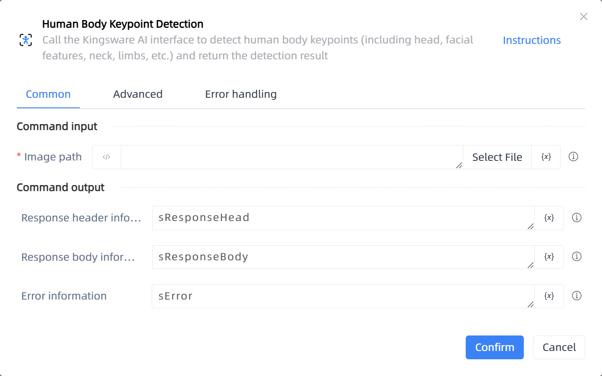

# Human Body Keypoint Detection

## Function Description

:::tip 
Call the Kingsware AI interface to detect human body keypoints (including head, facial features, neck, limbs, etc.) and return the detection result
:::

## Configuration Item Description

### General

**Command Input**

- **Image path**`string`: Enter or select the image path

**Command Output**

- **Response header information**`String`: Return response header information

- **Response body information**`String`: Return response body information

- **Error information**`String`: Return error information

### Advanced

- **Response header type**`array of string`: When the server and client create a long connection, necessary settings should be made for the HTTP response header's connection, default is ['Connection']

- **DelayBefore(milliseconds)**`Integer`: The waiting time before instruction execution

- **Timeout (milliseconds)**`Integer`: Maximum wait time (milliseconds)

**Command Output**

### Error Handling

- **Print Error Logs**`Boolean`: Whether to print error logs to the "Logs" panel when the command fails. Default is checked. 

- **Handling Method**`Integer`:

    - **Terminate Process**: If the command fails, terminate the process.

    - **Ignore Exception and Continue Execution**: If the command fails, ignore the exception and continue the process.

    - **Retry This Command**: If the command fails, retry the command a specified number of times with a specified interval between retries.

## Usage Example

Process logic description:

## Common Errors and Handling

None

## Frequently Asked Questions

None

