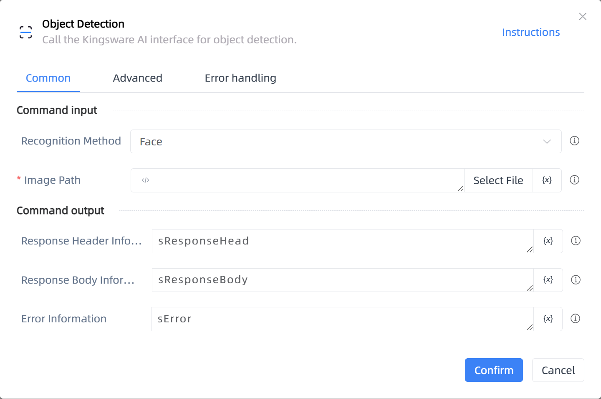

# Object Detection

## Function Description

:::tip 
Call the Kingsware AI interface for object detection.
:::

## Configuration Item Description

### General

**Command Input**

- **Recognition Method**`Integer`: Select a recognition method.

- **Image Path**`string`: Enter the image address to be selected.

**Command Output**

- **Response Header Information**`String`: Specify a variable to store the response header information.

- **Response Body Information**`String`: Specify a variable to store the response body information.

- **Error Information**`String`: Specify a variable to store the error information.

### Advanced

- **Response Header Type**`array of string`: When the server and client establish a long connection, it is necessary to set the HTTP response header 'Connection'. The default is ['Connection'].

- **DelayBefore(milliseconds)**`Integer`: The waiting time before instruction execution

- **Timeout (milliseconds)**`Integer`: Maximum wait time (milliseconds)

**Command Output**

### Error Handling

- **Print Error Logs**`Boolean`: Whether to print error logs to the "Logs" panel when the command fails. Default is checked. 

- **Handling Method**`Integer`:

    - **Terminate Process**: If the command fails, terminate the process.

    - **Ignore Exception and Continue Execution**: If the command fails, ignore the exception and continue the process.

    - **Retry This Command**: If the command fails, retry the command a specified number of times with a specified interval between retries.

## Usage Example

Process logic description:

## Common Errors and Handling

None

## Frequently Asked Questions

None

