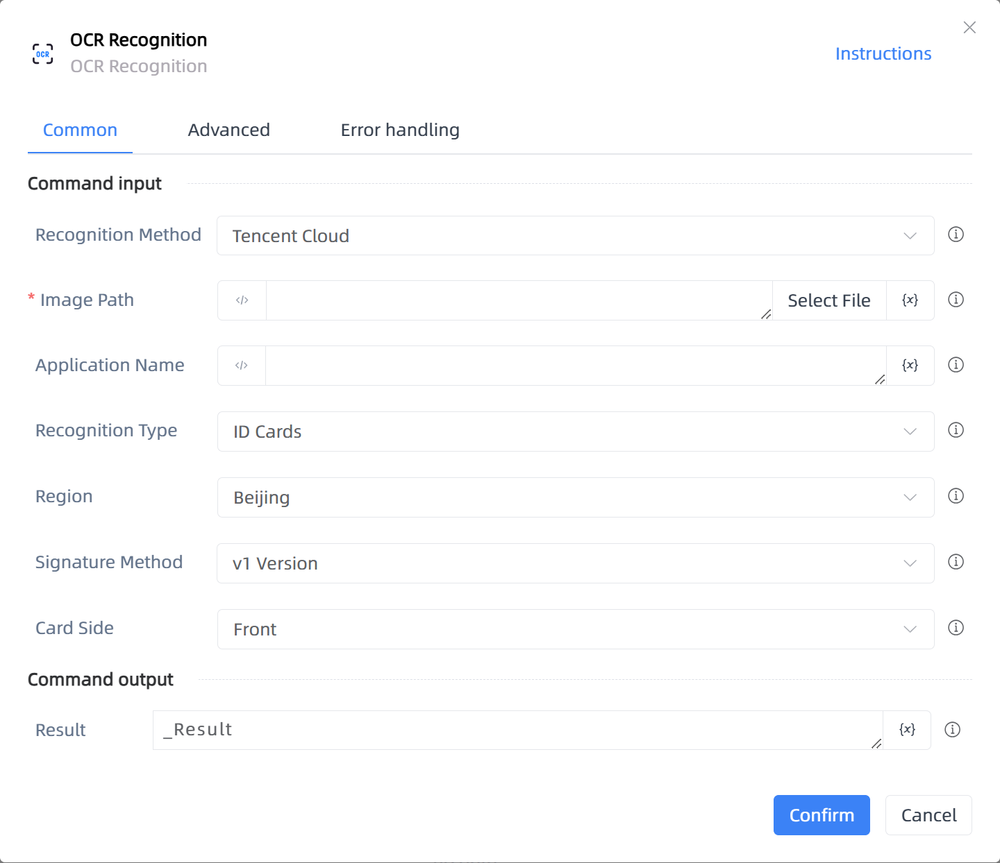

# OCR Recognition

## Function Description

:::tip 
OCR Recognition
:::

## Configuration Item Description

### General

**Command Input**

- **Recognition Method**`Integer`: Select recognition method

- **Image Path**`string`: Enter the image address to be selected

- **Application Name**`string`: Application Name

- **Recognition Type**`Integer`: Recognition Type

- **Region**`Integer`: Region

- **Signature Method**`Integer`: Signature method used for API requests

- **Card Side**`Integer`: Front or back of the card

**Command Output**

- **Result**`string`: Specify a variable to store the recognition result

### Advanced

- **Proxy Parameter**`string`: When our program cannot directly connect to the target network but the other party has installed a proxy server, format: address:port

- **DelayBefore(milliseconds)**`Integer`: The waiting time before instruction execution

- **Timeout (milliseconds)**`Integer`: Maximum wait time (milliseconds)

**Command Output**

### Error Handling

- **Print Error Logs**`Boolean`: Whether to print error logs to the "Logs" panel when the command fails. Default is checked. 

- **Handling Method**`Integer`:

    - **Terminate Process**: If the command fails, terminate the process.

    - **Ignore Exception and Continue Execution**: If the command fails, ignore the exception and continue the process.

    - **Retry This Command**: If the command fails, retry the command a specified number of times with a specified interval between retries.

## Usage Example

Process logic description:

## Common Errors and Handling

None

## Frequently Asked Questions

None

