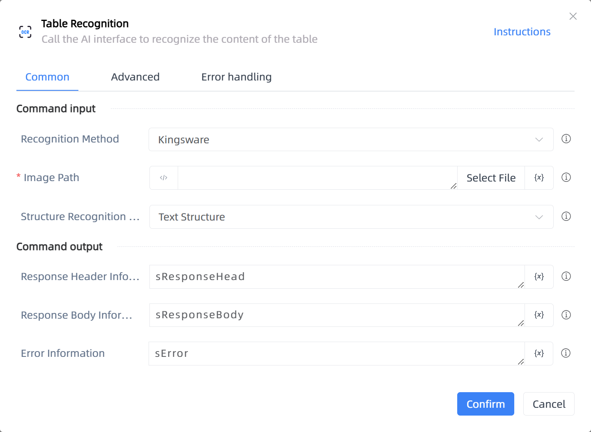

# Table Recognition

## Function Description

:::tip 
Call the AI interface to recognize the content of the table
:::

## Configuration Item Description

### General

**Command Input**

- **Recognition Method**`Integer`: Select the recognition method

- **Image Path**`string`: Enter the image address to be selected

- **Structure Recognition Type**`Integer`: Return table structure analysis, or only return text detection results

- **Version**`Integer`: Old Version V1.0: Calls the interface from the old official website of INTSIG; New Version V1.0: Calls the interface from the new official website of INTSIG, returning the recognized content in coordinates format; New Version V2.0: Calls the interface from the new official website of INTSIG, returning the recognized content in JSON format

**Command Output**

- **Result**`string`: Specify a variable to store the recognition result

- **Response Header Information**`String`: Specify a variable to store the response header information

- **Response Body Information**`String`: Specify a variable to store the response body information

- **Error Information**`String`: Specify a variable to store the error information

### Advanced

- **Proxy Parameter**`string`: When our program cannot directly connect to the target network but the other party has installed a proxy server, format is Address:Port

- **Response Header Type**`array of string`: When the server and client create a long connection, necessary settings for the HTTP response header's connection are required. The default is ['Connection']

- **DelayBefore(milliseconds)**`Integer`: The waiting time before instruction execution

- **Timeout (milliseconds)**`Integer`: Maximum wait time (milliseconds)

**Command Output**

### Error Handling

- **Print Error Logs**`Boolean`: Whether to print error logs to the "Logs" panel when the command fails. Default is checked. 

- **Handling Method**`Integer`:

    - **Terminate Process**: If the command fails, terminate the process.

    - **Ignore Exception and Continue Execution**: If the command fails, ignore the exception and continue the process.

    - **Retry This Command**: If the command fails, retry the command a specified number of times with a specified interval between retries.

## Usage Example

Process logic description:

## Common Errors and Handling

None

## Frequently Asked Questions

None

