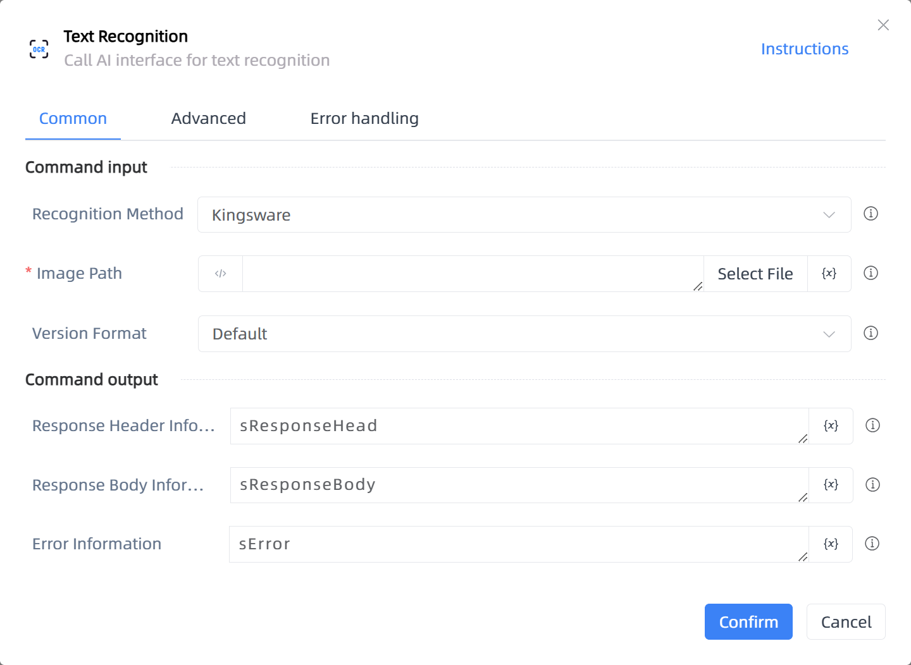

# Text Recognition

## Function Description

:::tip 
Call AI interface for text recognition
:::

## Configuration Item Description

### General

**Command Input**

- **Recognition Method**`Integer`: Select recognition method

- **Image Path**`string`: 

- **Version Format**`string`: Language type for detection, default is CHN_ENG

- **Version**`Integer`: Old Version V1.0: Uses the old API from INTSIG official website; New Version V1.0: Uses the new API from INTSIG's official website and returns recognized content in coordinates; New Version V2.0: Uses the new API from INTSIG's official website and returns recognized content in JSON format

- **Recognition Type**`Integer`: Select recognition type

**Command Output**

- **Result**`string`: Specify a variable to store the recognition result

- **Response Header Information**`String`: Specify a variable to store response header information

- **Response Body Information**`String`: Specify a variable to store response body information

- **Error Information**`String`: Specify a variable to store error information

### Advanced

- **Proxy Parameters**`string`: When our program cannot directly connect to the target network but the other party has installed a proxy server, format: address:port

- **Response Header Type**`array of string`: When the server and client establish a long connection, necessary settings for the HTTP response header's connection must be made, default is ['Connection']

- **DelayBefore(milliseconds)**`Integer`: The waiting time before instruction execution

- **Timeout (milliseconds)**`Integer`: Maximum wait time (milliseconds)

**Command Output**

### Error Handling

- **Print Error Logs**`Boolean`: Whether to print error logs to the "Logs" panel when the command fails. Default is checked. 

- **Handling Method**`Integer`:

    - **Terminate Process**: If the command fails, terminate the process.

    - **Ignore Exception and Continue Execution**: If the command fails, ignore the exception and continue the process.

    - **Retry This Command**: If the command fails, retry the command a specified number of times with a specified interval between retries.

## Usage Example

Process logic description:

## Common Errors and Handling

None

## Frequently Asked Questions

None

