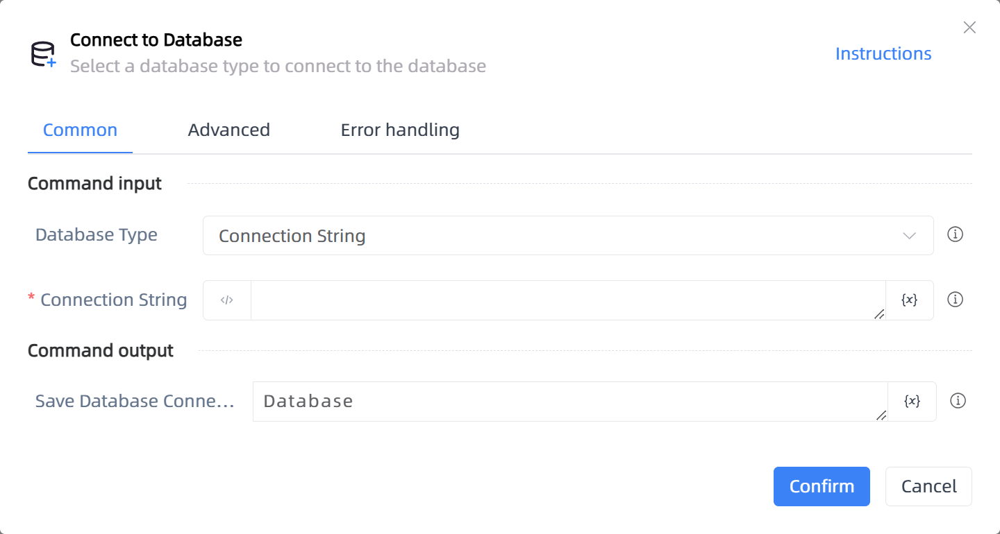

# Connect to Database

## Function Description

:::tip 
Select a database type to connect to the database
:::

## Configuration Item Description

### General

**Command Input**

- **Database Type**`Integer`: Select a database connection type

- **Connection String**`string`: Please enter the database connection string

- **Address**`string`: Please enter the database connection address

- **Port**`Integer`: Please enter the database connection port

- **Database**`string`: Please enter the database name

- **Username**`string`: Please enter the database username

- **Password**`string`: Please enter the database password

- **Database Charset**`string`: Please enter the database charset

- **Login Method**`Integer`: Select a login method

**Command Output**

- **Save Database Connection Object to**`TDatabase`: Specify a variable name that will store the database connection object

### Advanced

- **Delay Before(milliseconds)**`Integer`: The waiting time before instruction execution

**Command Output**

### Error Handling

- **Print Error Logs**`Boolean`: Whether to print error logs to the "Logs" panel when the command fails. Default is checked. 

- **Handling Method**`Integer`:

    - **Terminate Process**: If the command fails, terminate the process.

    - **Ignore Exception and Continue Execution**: If the command fails, ignore the exception and continue the process.

    - **Retry This Command**: If the command fails, retry the command a specified number of times with a specified interval between retries.

## Usage Example

Process logic description:

## Common Errors and Handling

None

## Frequently Asked Questions

None

