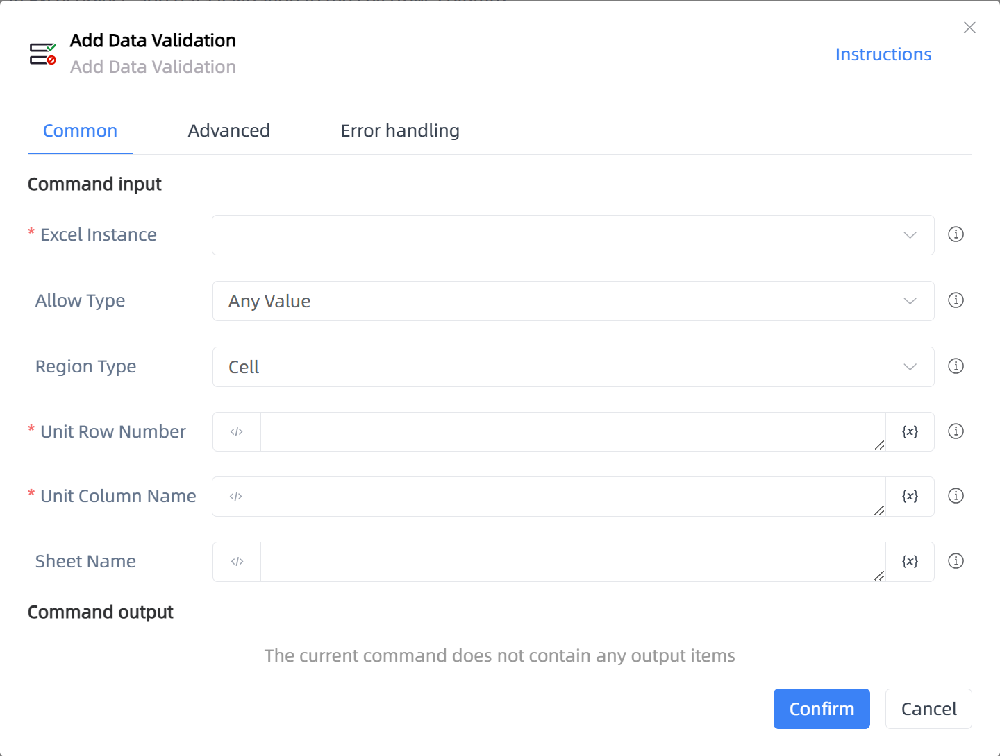

# Add Data Validation

## Function Description

:::tip 
Add Data Validation
:::

## Configuration Item Description

### General

**Command Input**

- **Excel Instance**`TWorkbookApplication`: Enter an Excel instance obtained by the functions 'Open or New Excel'/'Get Active Excel Instance'

- **Allow Type**`Integer`: Allow Type

- **Ignore Null Values**`Boolean`: If checked, null values will be ignored

- **Provide Dropdown Arrow**`Boolean`: Provide Dropdown Arrow

- **Data Type**`Integer`: Select data calculation method

- **Minimum Value**`Integer`: Minimum Value

- **Maximum Value**`Integer`: Maximum Value

- **Source**`string`: Source

- **Start Date**`string`: Start Date

- **End Date**`string`: End Date

- **Start Time**`string`: Start Time

- **End Time**`string`: End Time

- **Formula**`string`: Formula

- **Region Type**`Integer`: Select the range for data validation

- **Unit Row Number**`Integer`: Enter the line number, starting from 1, -N represents the nth to last row

- **Unit Column Name**`string`: Enter the column name, starting from A or 1, -N represents the nth to last column

- **Start Row Number**`Integer`: Enter the line number, starting from 1, -N represents the nth to last row

- **Start Column Name**`string`: Enter the column name, starting from A or 1, -N represents the nth to last column

- **End Row Number**`Integer`: Enter the line number, starting from 1, -N represents the nth to last row

- **End Column Name**`string`: Enter the column name, starting from A or 1, -N represents the nth to last column

- **Row Number**`Integer`: Enter the line number, starting from 1, -N represents the nth to last row

- **Column Name**`string`: Enter the column name, starting from A or 1, -N represents the nth to last column

- **Sheet Name**`string`: Worksheet name

**Command Output**

No output for the current command

### Advanced

- **Delay Before(milliseconds)**`Integer`: The waiting time before instruction execution

**Command Output**

### Error Handling

- **Print Error Logs**`Boolean`: Whether to print error logs to the "Logs" panel when the command fails. Default is checked. 

- **Handling Method**`Integer`:

    - **Terminate Process**: If the command fails, terminate the process.

    - **Ignore Exception and Continue Execution**: If the command fails, ignore the exception and continue the process.

    - **Retry This Command**: If the command fails, retry the command a specified number of times with a specified interval between retries.

## Usage Example

Process logic description:

## Common Errors and Handling

None

## Frequently Asked Questions

None

