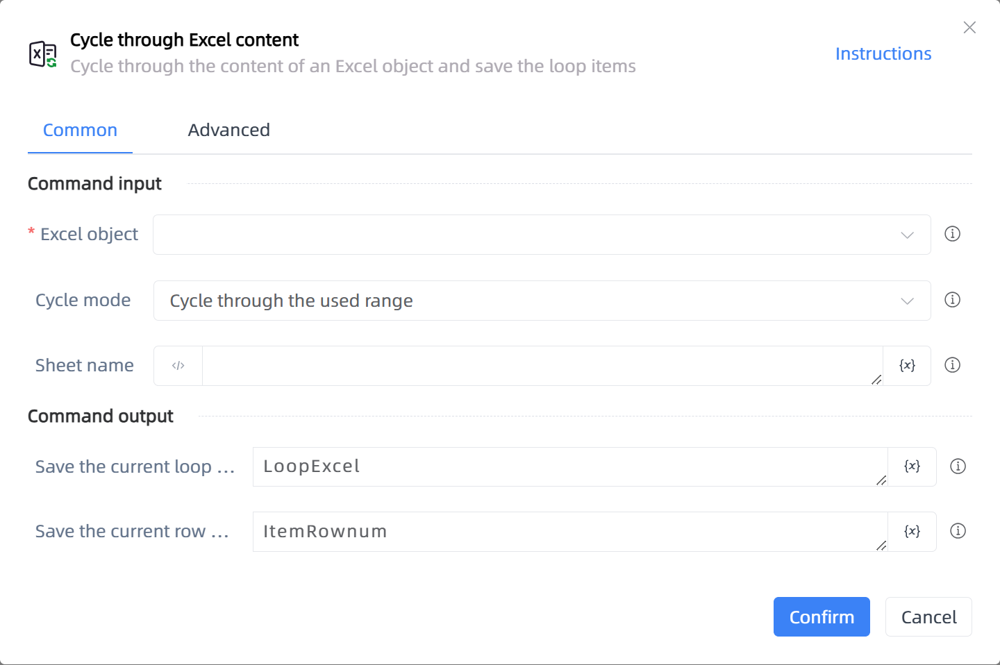

# Cycle through Excel content

## Function Description

:::tip 
Cycle through the content of an Excel object and save the loop items
:::

## Configuration Item Description

### General

**Command Input**

- **Excel object**`TWorkbookApplication`: Enter an Excel object obtained through the functions 'Open or create a new Excel'/'Get the currently active Excel object'

- **Cycle mode**`Integer`: Cycle through consecutive rows or columns

- **Starting row number**`Integer`: Enter the line number, starting from 1, -N represents the nth to last row

- **Ending row number**`Integer`: Enter the line number, starting from 1, -N represents the nth to last row

- **Starting column name**`string`: Enter the column name (supports A or 1), -N represents the nth to last column

- **Ending column name**`string`: Enter the column name (supports A or 1), -N represents the nth to last column

- **Sheet name**`string`: If left blank, the currently active sheet will be used by default

**Command Output**

- **Save the current loop item to**`TList<String>`: Specify a variable to save the Excel loop item

- **Save the current row number to**`Integer`: Specify a variable to save the row number of the Excel loop item

- **Save the current column name to**`string`: Specify a variable to save the column name of the Excel loop item

### Advanced

- **Read the displayed content of cells**`Boolean`: If not checked, integers will be read as decimals (1 = 1.0)

- **Columns to display content**`string`: Display visible content. Separate multiple columns with commas

- **Remove leading and trailing spaces from cells**`Boolean`: If checked, leading and trailing spaces in the read content will be automatically removed

- **Delay Before(milliseconds)**`Integer`: The waiting time before instruction execution

**Command Output**

### Error Handling

- **Print Error Logs**`Boolean`: Whether to print error logs to the "Logs" panel when the command fails. Default is checked. 

- **Handling Method**`Integer`:

    - **Terminate Process**: If the command fails, terminate the process.

    - **Ignore Exception and Continue Execution**: If the command fails, ignore the exception and continue the process.

    - **Retry This Command**: If the command fails, retry the command a specified number of times with a specified interval between retries.

## Usage Example

Process logic description:

## Common Errors and Handling

None

## Frequently Asked Questions

None

