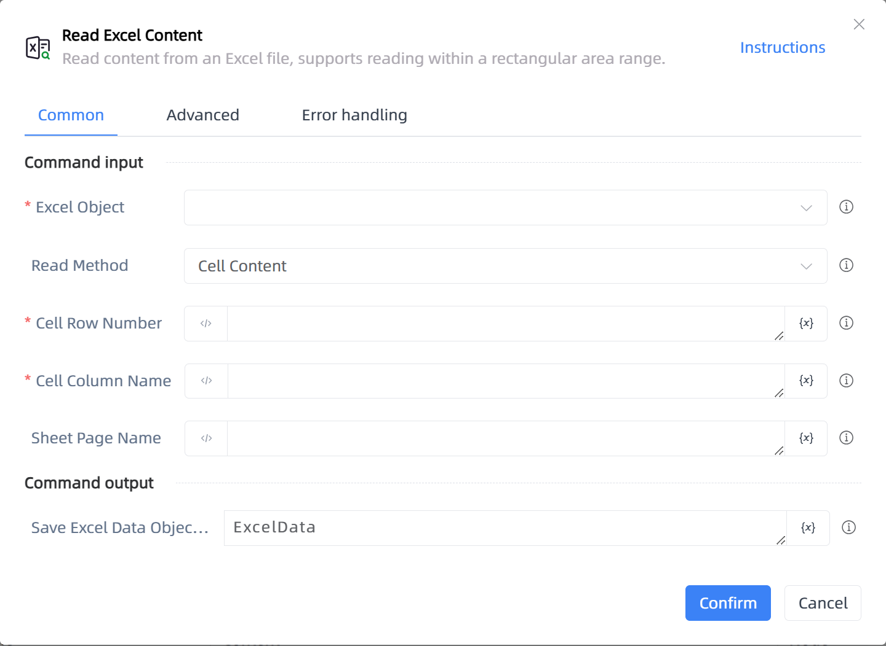

# Read Excel Content

## Function Description

:::tip 
Read content from an Excel file, supports reading within a rectangular area range.
:::

## Configuration Item Description

### General

**Command Input**

- **Excel Object**`TWorkbookApplication`: Input an Excel object obtained through the function 'Open or New Excel'/'Get Currently Active Excel Object'.

- **Read Method**`Integer`: The method of reading an Excel file.

- **Cell Row Number**`Integer`: Enter the line number, starting from 1, -N represents the nth to last row

- **Cell Column Name**`string`: Enter the column name (supports A or 1), -N represents the nth to last column

- **Row Number**`Integer`: Enter the line number, starting from 1, -N represents the nth to last row

- **Column Name**`string`: Enter the column name (supports A or 1), -N represents the nth to last column

- **Starting Row Number**`Integer`: Enter the line number, starting from 1, -N represents the nth to last row

- **Starting Column Name**`string`: Enter the column name (supports A or 1), -N represents the nth to last column

- **Ending Row Number**`Integer`: Enter the line number, starting from 1, -N represents the nth to last row

- **Ending Column Name**`string`: Enter the column name (supports A or 1), -N represents the nth to last column

- **Sheet Page Name**`string`: If empty, it defaults to the currently active Sheet page.

**Command Output**

- **Save Excel Data Object To**`TDataTable`: Save area data content.

### Advanced

- **Displayed Content Column**`string`: Display visible content, multiple columns separated by commas.

- **Clear Space Before and After Cell**`Boolean`: If checked, automatically clears spaces before and after the read content.

- **Delay Before(milliseconds)**`Integer`: The waiting time before instruction execution

**Command Output**

### Error Handling

- **Print Error Logs**`Boolean`: Whether to print error logs to the "Logs" panel when the command fails. Default is checked. 

- **Handling Method**`Integer`:

    - **Terminate Process**: If the command fails, terminate the process.

    - **Ignore Exception and Continue Execution**: If the command fails, ignore the exception and continue the process.

    - **Retry This Command**: If the command fails, retry the command a specified number of times with a specified interval between retries.

## Usage Example

Process logic description:

## Common Errors and Handling

None

## Frequently Asked Questions

None

