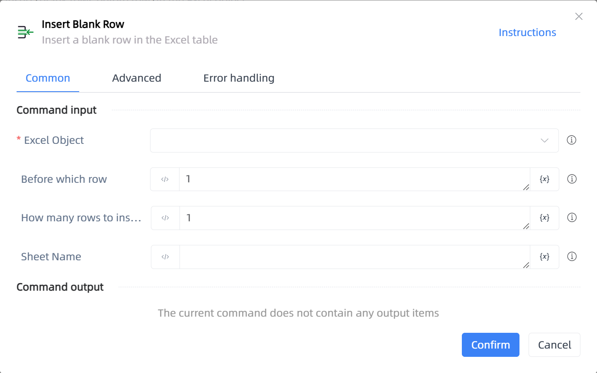

# Insert Blank Row

## Function Description

:::tip 
Insert a blank row in the Excel table
:::

## Configuration Item Description

### General

**Command Input**

- **Excel Object**`TWorkbookApplication`: Enter an Excel object obtained through the function 'Open or New Excel'/'Get currently active Excel object'

- **Before which row**`Integer`: Enter the line number, starting from 1, -N represents the nth to last row

- **How many rows to insert**`Integer`: How many blank rows to insert

- **Sheet Name**`string`: If empty, it defaults to the currently active sheet

**Command Output**

No output for the current command

### Advanced

- **Delay Before(milliseconds)**`Integer`: The waiting time before instruction execution

**Command Output**

### Error Handling

- **Print Error Logs**`Boolean`: Whether to print error logs to the "Logs" panel when the command fails. Default is checked. 

- **Handling Method**`Integer`:

    - **Terminate Process**: If the command fails, terminate the process.

    - **Ignore Exception and Continue Execution**: If the command fails, ignore the exception and continue the process.

    - **Retry This Command**: If the command fails, retry the command a specified number of times with a specified interval between retries.

## Usage Example

Process logic description:

## Common Errors and Handling

None

## Frequently Asked Questions

None

