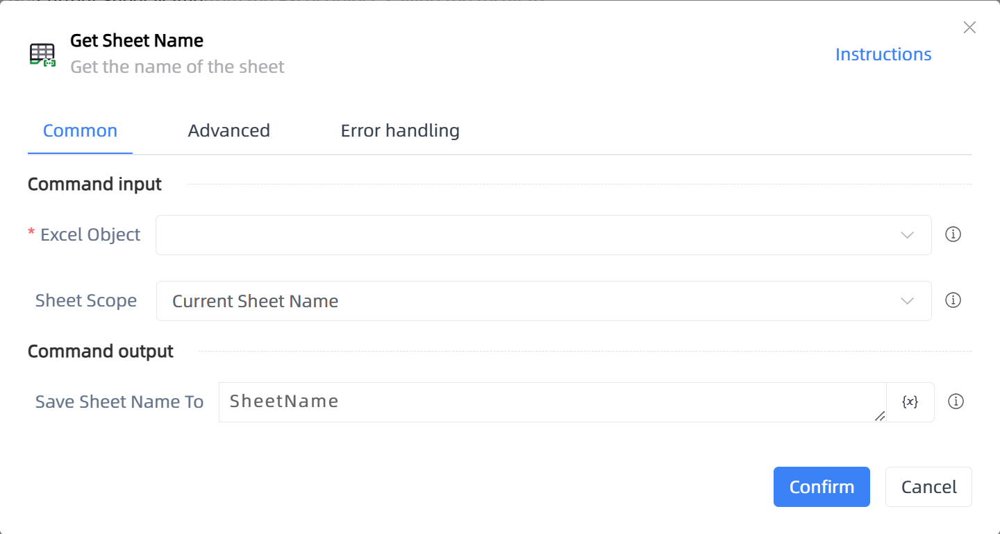

# Get Sheet Name

## Function Description

:::tip 
Get the name of the sheet
:::

## Configuration Item Description

### General

**Command Input**

- **Excel Object**`TWorkbookApplication`: Enter an Excel object obtained through the function 'Open or New Excel'/'Get currently active Excel object'

- **Sheet Scope**`Integer`: Select the sheet to get the name from

**Command Output**

- **Save Sheet Name To**`string`: Variable to save the sheet name

- **Save Sheet Name List To**`TList<String>`: Specify a variable to save the list of sheet names

### Advanced

- **Delay Before(milliseconds)**`Integer`: The waiting time before instruction execution

**Command Output**

### Error Handling

- **Print Error Logs**`Boolean`: Whether to print error logs to the "Logs" panel when the command fails. Default is checked. 

- **Handling Method**`Integer`:

    - **Terminate Process**: If the command fails, terminate the process.

    - **Ignore Exception and Continue Execution**: If the command fails, ignore the exception and continue the process.

    - **Retry This Command**: If the command fails, retry the command a specified number of times with a specified interval between retries.

## Usage Example

Process logic description:

## Common Errors and Handling

None

## Frequently Asked Questions

None

