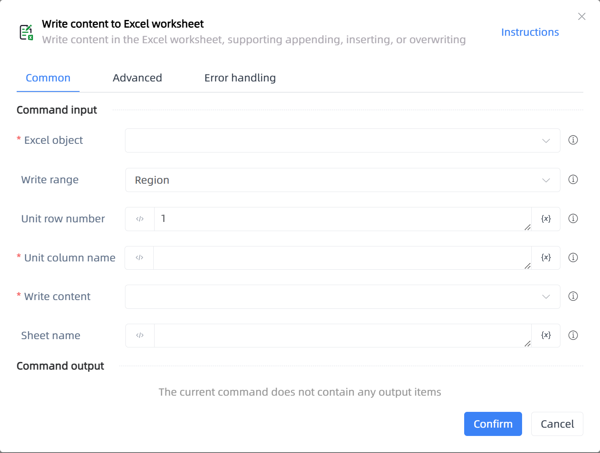

# Write content to Excel worksheet

## Function Description

:::tip 
Write content in the Excel worksheet, supporting appending, inserting, or overwriting
:::

## Configuration Item Description

### General

**Command Input**

- **Excel object**`TWorkbookApplication`: Enter an Excel object obtained through the 'Open or create new Excel' / 'Get currently active Excel object' function

- **Write range**`Integer`: Select the write range

- **Unit row number**`Integer`: Enter the line number, starting from 1, -N represents the nth to last row

- **Unit column name**`string`: Enter the column name (supports A or 1), -N represents the nth to last column

- **Starting column name**`string`: Enter the column name (supports A or 1), -N represents the nth to last column

- **Row number**`Integer`: Enter the line number, starting from 1, -N represents the nth to last row

- **Starting row number**`Integer`: Enter the line number, starting from 1, -N represents the nth to last row

- **Write method**`Integer`: Select the write method

- **Column name**`string`: Enter the column name (supports A or 1), -N represents the nth to last column

- **Write content**`TDataTable`: When the region is a range, the write content should be a data table type variable

- **Sheet name**`string`: If empty, it defaults to the currently active sheet

**Command Output**

No output for the current command

### Advanced

- **Delay Before(milliseconds)**`Integer`: The waiting time before instruction execution

**Command Output**

### Error Handling

- **Print Error Logs**`Boolean`: Whether to print error logs to the "Logs" panel when the command fails. Default is checked. 

- **Handling Method**`Integer`:

    - **Terminate Process**: If the command fails, terminate the process.

    - **Ignore Exception and Continue Execution**: If the command fails, ignore the exception and continue the process.

    - **Retry This Command**: If the command fails, retry the command a specified number of times with a specified interval between retries.

## Usage Example

Process logic description:

## Common Errors and Handling

None

## Frequently Asked Questions

None

