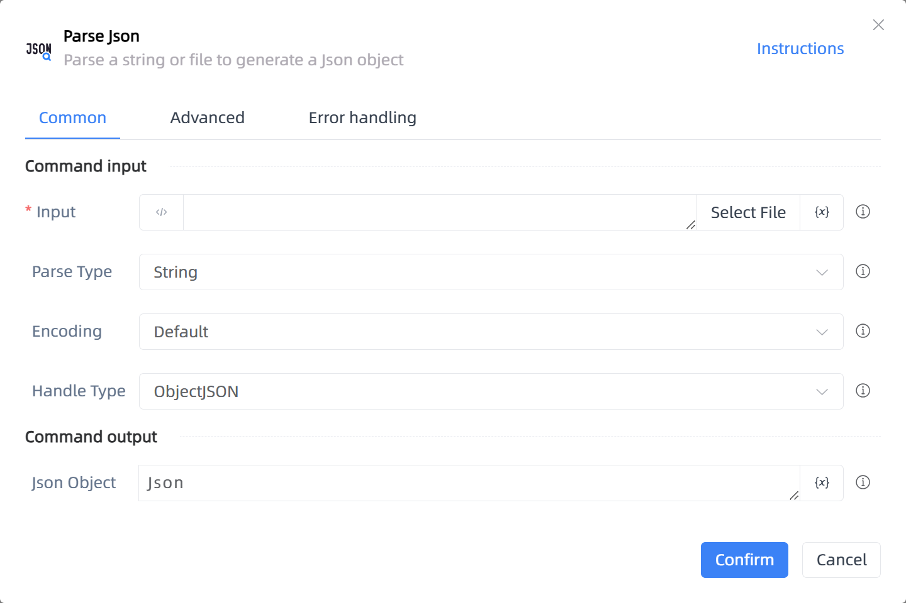

# Parse Json

## Function Description

:::tip 
Parse a string or file to generate a Json object
:::

## Configuration Item Description

### General

**Command Input**

- **Input**`string`: Input Json string or Json file

- **Parse Type**`Integer`: Select parse method: file/string

- **Encoding**`Integer`: File encoding

- **Handle Type**`Integer`: Json handling type, default uses original logic, second option uses uLkJSON handling logic.

**Command Output**

- **Json Object**`TJson`: Returned Json object

### Advanced

- **Delay Before(milliseconds)**`Integer`: The waiting time before instruction execution

**Command Output**

### Error Handling

- **Print Error Logs**`Boolean`: Whether to print error logs to the "Logs" panel when the command fails. Default is checked. 

- **Handling Method**`Integer`:

    - **Terminate Process**: If the command fails, terminate the process.

    - **Ignore Exception and Continue Execution**: If the command fails, ignore the exception and continue the process.

    - **Retry This Command**: If the command fails, retry the command a specified number of times with a specified interval between retries.

## Usage Example

Process logic description:

## Common Errors and Handling

None

## Frequently Asked Questions

None

