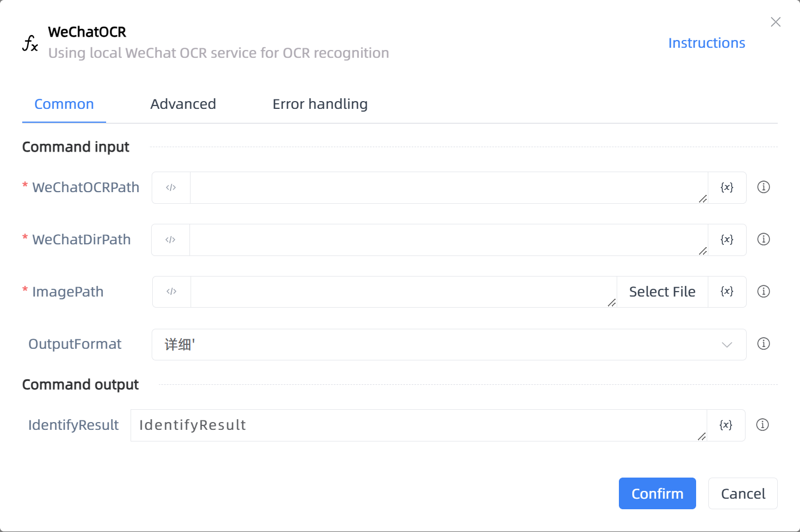

# WeChatOCR

## Function Description

:::tip 
Using local WeChat OCR service for OCR recognition
:::

## Configuration Item Description

### General

**Command Input**

- **WeChatOCRPath**`string`: The folder path where WeChatOCR.exe is located can be viewed in the Task Manager

- **WeChatDirPath**`string`: The directory path of the WeChat installation folder

- **ImagePath**`string`: The image path to be recognized

- **OutputFormat**`Integer`: Output format, optional [Details] and [Simplification], [Details]: text, coordinates, recognition rate, [Simplification]: text

**Command Output**

- **IdentifyResult**`string`: The result recognized by WeChat OCR

### Advanced

- **Delay Before(milliseconds)**`Integer`: The waiting time before instruction execution

**Command Output**

### Error Handling

- **Print Error Logs**`Boolean`: Whether to print error logs to the "Logs" panel when the command fails. Default is checked. 

- **Handling Method**`Integer`:

    - **Terminate Process**: If the command fails, terminate the process.

    - **Ignore Exception and Continue Execution**: If the command fails, ignore the exception and continue the process.

    - **Retry This Command**: If the command fails, retry the command a specified number of times with a specified interval between retries.

## Usage Example

Process logic description:

## Common Errors and Handling

None

## Frequently Asked Questions

None

