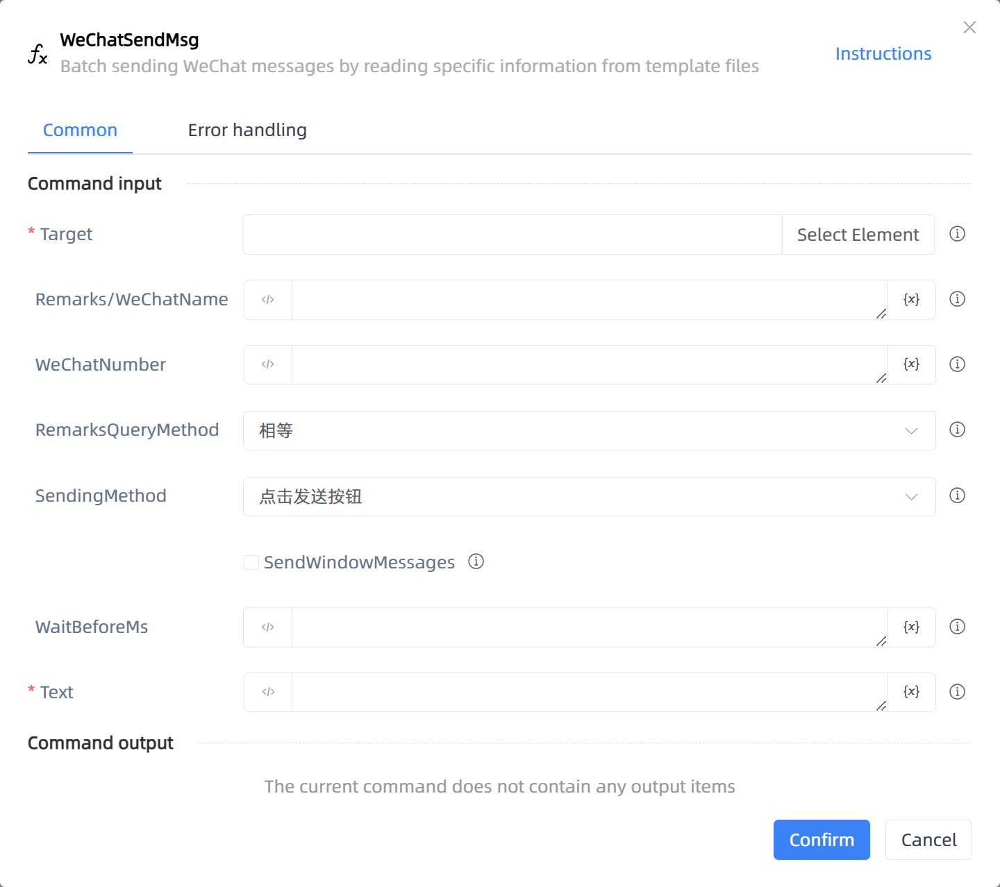

# WeChatSendMsg

## Function Description

:::tip 
Batch sending WeChat messages by reading specific information from template files
:::

## Configuration Item Description

### General

**Command Input**

- **Target**`TTarget`: Target, indicate WeChat operation elements, please capture the outermost window of WeChat

- **Remarks/WeChatName**`string`: Priority should be given to searching through Remarks/WeChatName

- **WeChatNumber**`string`: Can specify to obtain chat messages with someone through WeChatNumber

- **RemarksQueryMethod**`Integer`: Remarks Supported search methods [equal query, fuzzy query]

- **SendingMethod**`Integer`: 

- **SendWindowMessages**`Boolean`: Whether to send WeChat messages through the background

- **WaitBeforeMs**`Integer`: 

- **Text**`string`: Messages to be sent

**Command Output**

No output for the current command

### Error Handling

- **Print Error Logs**`Boolean`: Whether to print error logs to the "Logs" panel when the command fails. Default is checked. 

- **Handling Method**`Integer`:

    - **Terminate Process**: If the command fails, terminate the process.

    - **Ignore Exception and Continue Execution**: If the command fails, ignore the exception and continue the process.

    - **Retry This Command**: If the command fails, retry the command a specified number of times with a specified interval between retries.

## Usage Example

Process logic description:

## Common Errors and Handling

None

## Frequently Asked Questions

None

