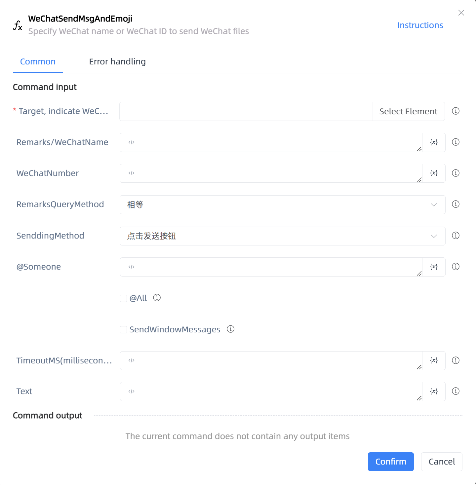

# WeChatSendMsgAndEmoji

## Function Description

:::tip 
Specify WeChat name or WeChat ID to send WeChat files
:::

## Configuration Item Description

### General

**Command Input**

- **Indicate the operational elements of WeChat, please use UIA mode to capture the outermost window of WeChat, UIA mode cannot capture, this parameter can be empty**`TTarget`: Target

- **Remarks/WeChatName**`string`: Priority should be given to searching through Remarks/WeChatName

- **WeChatNumber**`string`: Can specify to obtain chat messages with someone through WeChatNumber

- **RemarksQueryMethod**`Integer`: Remarks Supported search methods [equal query, fuzzy query]

- **SenddingMethod**`Integer`: Whether to send WeChat messages through the background

- **@Someone**`TList<String>`: The WeChat name list of the person who needs @ needs to be created by CreateStringList

- **@All**`Boolean`: After selecting @ everyone, if there is no @ everyone permission, an error will be reported. If @ everyone is selected, @ someone will not take effect

- **SendWindowMessages**`Boolean`: Whether to send WeChat messages through the background

- **TimeoutMS(milliseconds)**`Integer`: Wait for loading time before execution (in milliseconds)

- **Text**`string`: Messages to be sent

**Command Output**

No output for the current command

### Error Handling

- **Print Error Logs**`Boolean`: Whether to print error logs to the "Logs" panel when the command fails. Default is checked. 

- **Handling Method**`Integer`:

    - **Terminate Process**: If the command fails, terminate the process.

    - **Ignore Exception and Continue Execution**: If the command fails, ignore the exception and continue the process.

    - **Retry This Command**: If the command fails, retry the command a specified number of times with a specified interval between retries.

## Usage Example

Process logic description:

## Common Errors and Handling

None

## Frequently Asked Questions

None

