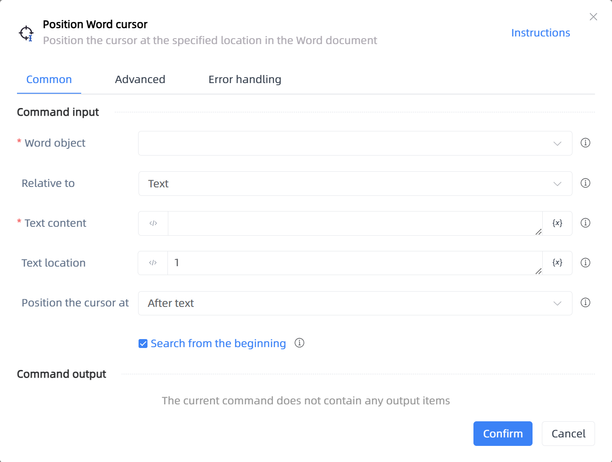

# Position Word cursor

## Function Description

:::tip 
Position the cursor at the specified location in the Word document
:::

## Configuration Item Description

### General

**Command Input**

- **Word object**`TDocumentApplication`: Enter a Word object created by the 'Open or Create Word' function

- **Relative to**`Integer`: Select positioning type

- **Text content**`string`: The text to be located

- **Text location**`Integer`: The location where the text appears

- **Search from the beginning**`Boolean`: If checked, search from the beginning; otherwise, search from the current position

- **Bookmark name**`string`: Bookmark name

- **Position the cursor at**`Integer`: Choose whether to position the cursor before or after the text

**Command Output**

No output for the current command

### Advanced

- **Delay Before(milliseconds)**`Integer`: The waiting time before instruction execution

**Command Output**

### Error Handling

- **Print Error Logs**`Boolean`: Whether to print error logs to the "Logs" panel when the command fails. Default is checked. 

- **Handling Method**`Integer`:

    - **Terminate Process**: If the command fails, terminate the process.

    - **Ignore Exception and Continue Execution**: If the command fails, ignore the exception and continue the process.

    - **Retry This Command**: If the command fails, retry the command a specified number of times with a specified interval between retries.

## Usage Example

Process logic description:

## Common Errors and Handling

None

## Frequently Asked Questions

None

