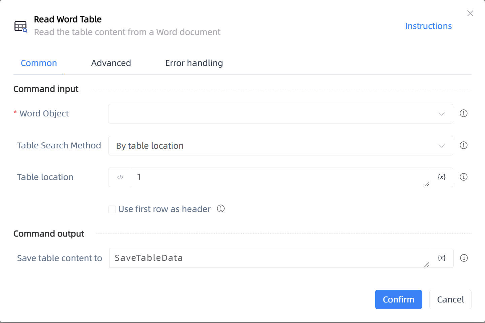

# Read Word Table

## Function Description

:::tip 
Read the table content from a Word document
:::

## Configuration Item Description

### General

**Command Input**

- **Word Object**`TDocumentApplication`: Enter a Word object created by the 'Open or Create Word' function

- **Table Search Method**`Integer`: Choose a method to search for the table

- **Table location**`Integer`: Enter the location of the table

- **Table search content**`string`: Enter the content needed to search for the table

- **Use first row as header**`Boolean`: Whether to use the first row as the header

**Command Output**

- **Save table content to**`TDataTable`: Specify a variable name to store the data content

### Advanced

- **Delay Before(milliseconds)**`Integer`: The waiting time before instruction execution

**Command Output**

### Error Handling

- **Print Error Logs**`Boolean`: Whether to print error logs to the "Logs" panel when the command fails. Default is checked. 

- **Handling Method**`Integer`:

    - **Terminate Process**: If the command fails, terminate the process.

    - **Ignore Exception and Continue Execution**: If the command fails, ignore the exception and continue the process.

    - **Retry This Command**: If the command fails, retry the command a specified number of times with a specified interval between retries.

## Usage Example

Process logic description:

## Common Errors and Handling

None

## Frequently Asked Questions

None

