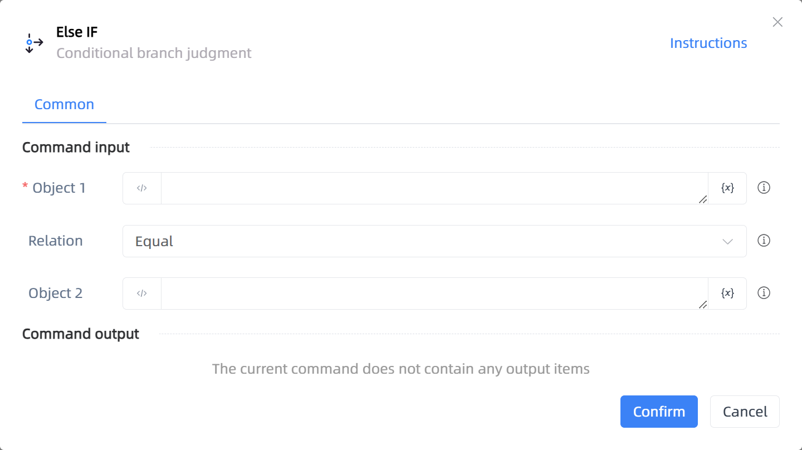

# Else IF

## Function Description

:::tip 
Conditional branch judgment
:::

## Configuration Item Description

### General

**Command Input**

- **Object 1**`string`: Input variables, text, or numbers created by previous instructions to compare with Object 2

- **Relation**`Integer`: Select the comparison method between Object 1 and Object 2

- **Object 2**`string`: Input variables, text, or numbers created by previous instructions to compare with Object 1

- **Whitespace**`Boolean`: Includes empty strings, spaces, newlines, tabs, page breaks, etc.

- **Ignore case**`Boolean`: If checked, the case is ignored during comparison

**Command Output**

No output for the current command

**Command Output**

### Error Handling

- **Print Error Logs**`Boolean`: Whether to print error logs to the "Logs" panel when the command fails. Default is checked. 

- **Handling Method**`Integer`:

    - **Terminate Process**: If the command fails, terminate the process.

    - **Ignore Exception and Continue Execution**: If the command fails, ignore the exception and continue the process.

    - **Retry This Command**: If the command fails, retry the command a specified number of times with a specified interval between retries.

## Usage Example

Process logic description:

## Common Errors and Handling

None

## Frequently Asked Questions

None

