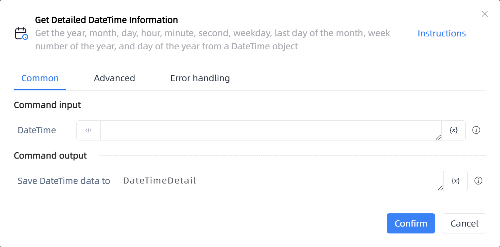

# Get Detailed DateTime Information

## Function Description

:::tip 
Get the year, month, day, hour, minute, second, weekday, last day of the month, week number of the year, and day of the year from a DateTime object
:::

## Configuration Item Description

### General

**Command Input**

- **DateTime**`TDateTime`: Enter a DateTime object

**Command Output**

- **Save DateTime data to**`TDateTime`: Specify a variable to save the year, month, day, hour, minute, and second information obtained

### Advanced

- **Delay Before(milliseconds)**`Integer`: The waiting time before instruction execution

**Command Output**

### Error Handling

- **Print Error Logs**`Boolean`: Whether to print error logs to the "Logs" panel when the command fails. Default is checked. 

- **Handling Method**`Integer`:

    - **Terminate Process**: If the command fails, terminate the process.

    - **Ignore Exception and Continue Execution**: If the command fails, ignore the exception and continue the process.

    - **Retry This Command**: If the command fails, retry the command a specified number of times with a specified interval between retries.

## Usage Example

Process logic description:

## Common Errors and Handling

None

## Frequently Asked Questions

None

