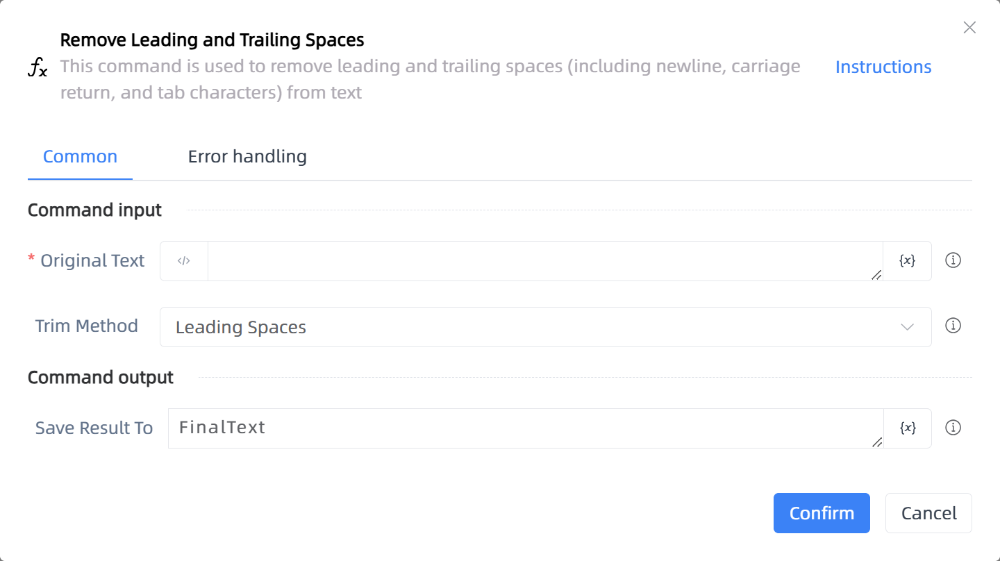

# Remove Leading and Trailing Spaces

## Function Description

:::tip 
This command is used to remove leading and trailing spaces (including newline, carriage return, and tab characters) from text
:::

## Configuration Item Description

### General

**Command Input**

- **Original Text**`string`: Enter a text string or select a variable containing the string

- **Trim Method**`Integer`: Select which side of the text's spaces you want to remove

**Command Output**

- **Save Result To**`string`: Specify a variable to save the trimmed text content

**Command Output**

### Error Handling

- **Print Error Logs**`Boolean`: Whether to print error logs to the "Logs" panel when the command fails. Default is checked. 

- **Handling Method**`Integer`:

    - **Terminate Process**: If the command fails, terminate the process.

    - **Ignore Exception and Continue Execution**: If the command fails, ignore the exception and continue the process.

    - **Retry This Command**: If the command fails, retry the command a specified number of times with a specified interval between retries.

## Usage Example

Process logic description:

## Common Errors and Handling

None

## Frequently Asked Questions

None

