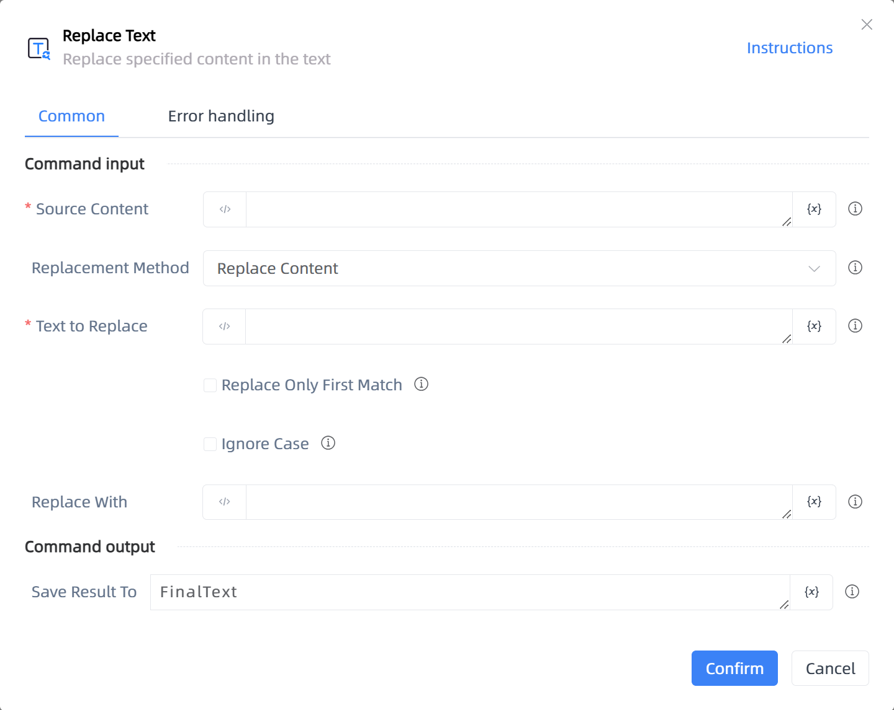

# Replace Text

## Function Description

:::tip 
Replace specified content in the text
:::

## Configuration Item Description

### General

**Command Input**

- **Source Content**`string`: Enter a text string or select a variable containing the string

- **Replacement Method**`Integer`: Select a method for extracting content

- **Regular Expression**`string`: Select a method for extracting content

- **Text to Replace**`string`: Enter the content to be replaced

- **Replace Only First Match**`Boolean`: For example, if two phone numbers are found in the text, you can replace only the first one

- **Ignore Case**`Boolean`: Whether to ignore case when matching strings

- **Replace With**`string`: Enter the replacement value

**Command Output**

- **Save Result To**`string`: Specify a variable to save the replaced content

**Command Output**

### Error Handling

- **Print Error Logs**`Boolean`: Whether to print error logs to the "Logs" panel when the command fails. Default is checked. 

- **Handling Method**`Integer`:

    - **Terminate Process**: If the command fails, terminate the process.

    - **Ignore Exception and Continue Execution**: If the command fails, ignore the exception and continue the process.

    - **Retry This Command**: If the command fails, retry the command a specified number of times with a specified interval between retries.

## Usage Example

Process logic description:

## Common Errors and Handling

None

## Frequently Asked Questions

None

