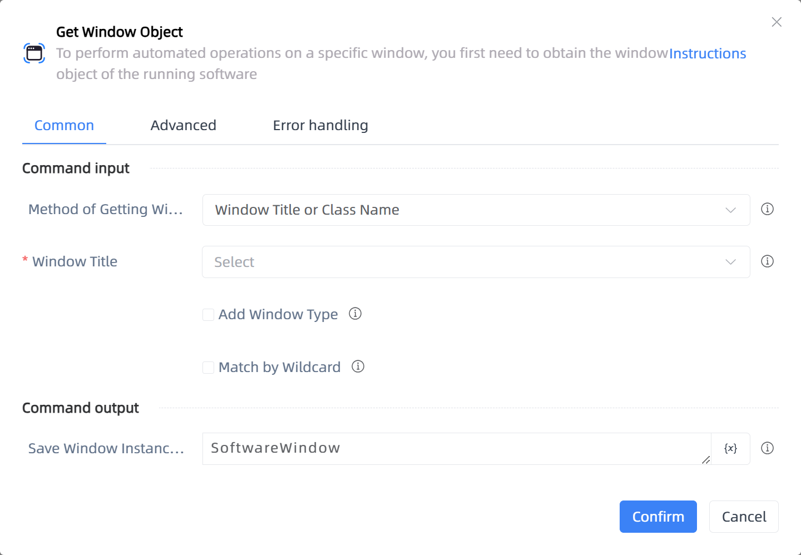

# Get Window Object

## Function Description

:::tip 
To perform automated operations on a specific window, you first need to obtain the window object of the running software
:::

## Configuration Item Description

### General

**Command Input**

- **Method of Getting Window**`Integer`: Select the method to get the window

- **Operation Target**`TTarget`: Select window element

- **Window Handle**`Integer`: Enter a window handle

- **Window Title**`string`: Enter window title

- **Add Window Type**`Boolean`: Add window type

- **Window Class Name**`string`: Enter window class name

- **Match by Wildcard**`Boolean`: Match by wildcard

**Command Output**

- **Save Window Instance To**`TWinObj`: This variable stores the window object, which can be used to perform automated operations on the window

### Advanced

- **Delay Before(milliseconds)**`Integer`: The waiting time before instruction execution

**Command Output**

### Error Handling

- **Print Error Logs**`Boolean`: Whether to print error logs to the "Logs" panel when the command fails. Default is checked. 

- **Handling Method**`Integer`:

    - **Terminate Process**: If the command fails, terminate the process.

    - **Ignore Exception and Continue Execution**: If the command fails, ignore the exception and continue the process.

    - **Retry This Command**: If the command fails, retry the command a specified number of times with a specified interval between retries.

## Usage Example

Process logic description:

## Common Errors and Handling

None

## Frequently Asked Questions

None

