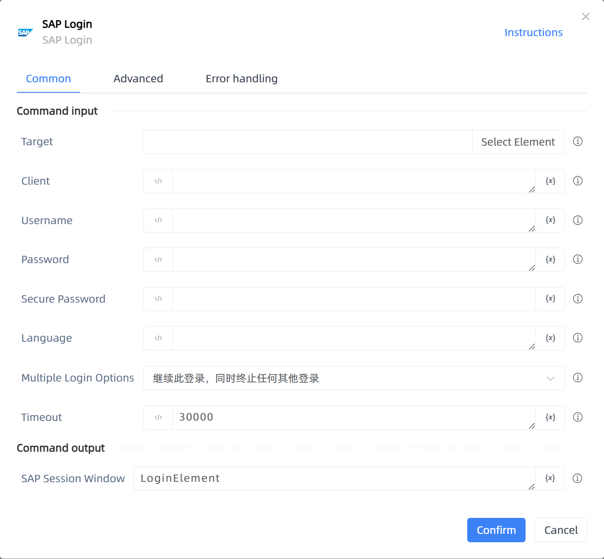

# SAP Login

## Function Description

:::tip 
SAP Login
:::

## Configuration Item Description

### General

**Command Input**

- **Target**`TTarget`: Target

- **Client**`string`: Client

- **Username**`string`: Username

- **Password**`string`: Password

- **Secure Password**`string`: Secure Password

- **Language**`string`: Language

- **Multiple Login Options**`Integer`: Multiple Login Options

- **Timeout**`Integer`: Timeout

**Command Output**

- **SAP Session Window**`TUiElement`: Specify a variable to save the SAP session window

### Advanced

- **Delay Before(milliseconds)**`Integer`: The waiting time before instruction execution

**Command Output**

### Error Handling

- **Print Error Logs**`Boolean`: Whether to print error logs to the "Logs" panel when the command fails. Default is checked. 

- **Handling Method**`Integer`:

    - **Terminate Process**: If the command fails, terminate the process.

    - **Ignore Exception and Continue Execution**: If the command fails, ignore the exception and continue the process.

    - **Retry This Command**: If the command fails, retry the command a specified number of times with a specified interval between retries.

## Usage Example

Process logic description:

## Common Errors and Handling

None

## Frequently Asked Questions

None

