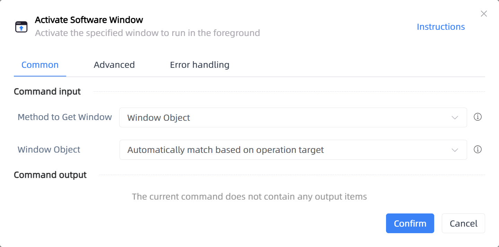

# Activate Software Window

## Function Description

:::tip 
Activate the specified window to run in the foreground
:::

## Configuration Item Description

### General

**Command Input**

- **Method to Get Window**`Integer`: Select the method to get the window

- **Window Object**`TWinObj`: Enter a captured window object

- **Operation Target**`TTarget`: Select a window element

- **Window Title**`string`: Enter the window title

- **Add Window Type**`Boolean`: Add window type

- **Window Type**`string`: Enter the window type

- **Match Using Wildcards**`Boolean`: Match using wildcards

- **Window Handle**`Integer`: Enter a window handle

**Command Output**

No output for the current command

### Advanced

- **Delay Before(milliseconds)**`Integer`: The waiting time before instruction execution

**Command Output**

### Error Handling

- **Print Error Logs**`Boolean`: Whether to print error logs to the "Logs" panel when the command fails. Default is checked. 

- **Handling Method**`Integer`:

    - **Terminate Process**: If the command fails, terminate the process.

    - **Ignore Exception and Continue Execution**: If the command fails, ignore the exception and continue the process.

    - **Retry This Command**: If the command fails, retry the command a specified number of times with a specified interval between retries.

## Usage Example

Process logic description:

## Common Errors and Handling

None

## Frequently Asked Questions

None

