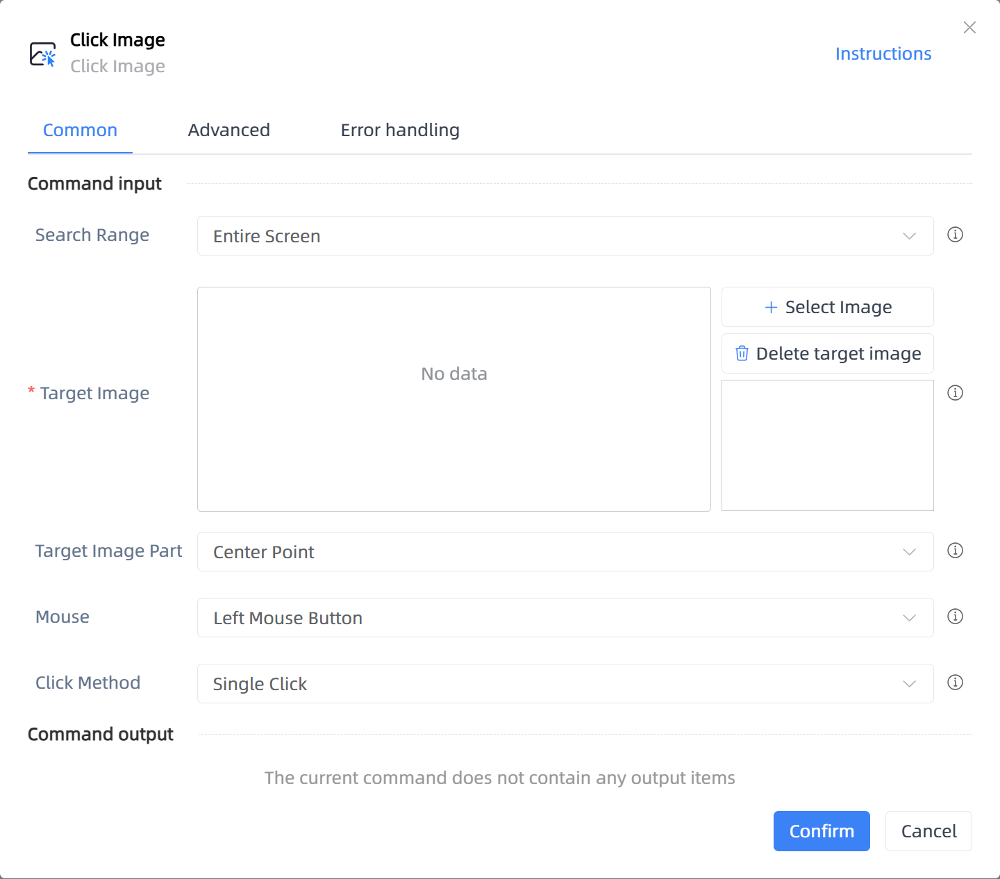

# Click Image

## Function Description

:::tip 
Click Image
:::

## Configuration Item Description

### General

**Command Input**

- **Search Range**`Integer`: Search Range

- **Window Object**`TWinObj`: Please select the window object

- **Target Image**`string`: You can select multiple images to search in sequence until any matching image is found within the timeout period and clicked

- **Target Image Part**`Integer`: Choose the part of the target image to click

- **Custom**`Integer`: Custom Position

- **Horizontal Translation**`Integer`: Enter a positive number to move right, negative to move left

- **Vertical Translation**`Integer`: Enter a positive number to move down, negative to move up

- **Mouse**`Integer`: Choose the mouse button used to trigger the click

- **Click Method**`Integer`: Single click or double click

**Command Output**

No output for the current command

### Advanced

- **Keyboard Modifier Keys**`Integer`: The keyboard function keys that need to be pressed

- **Show Mouse Movement Path**`Boolean`: Whether to show the mouse movement path

- **Timeout (milliseconds)**`Integer`: Set the maximum wait time

- **Delay Before(milliseconds)**`Integer`: The waiting time before instruction execution

- **Delay After Execution (milliseconds)**`Integer`: Time to wait after the command is executed

**Command Output**

### Error Handling

- **Print Error Logs**`Boolean`: Whether to print error logs to the "Logs" panel when the command fails. Default is checked. 

- **Handling Method**`Integer`:

    - **Terminate Process**: If the command fails, terminate the process.

    - **Ignore Exception and Continue Execution**: If the command fails, ignore the exception and continue the process.

    - **Retry This Command**: If the command fails, retry the command a specified number of times with a specified interval between retries.

## Usage Example

Process logic description:

## Common Errors and Handling

None

## Frequently Asked Questions

None

