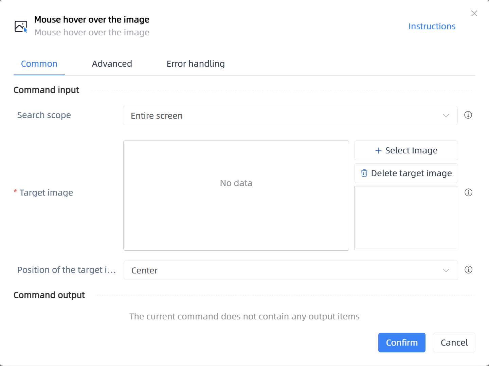

# Mouse hover over the image

## Function Description

:::tip 
Mouse hover over the image
:::

## Configuration Item Description

### General

**Command Input**

- **Search scope**`Integer`: Search scope

- **Window object**`TWinObj`: Please select the window object

- **Target image**`string`: Multiple images can be selected, and they will be searched in sequence until any matching image is found and clicked within the timeout period

- **Position of the target image**`Integer`: Select the position on the target image to hover

- **Custom**`Integer`: Custom position

- **Horizontal offset**`Integer`: Enter a positive value to move right, negative value to move left

- **Vertical offset**`Integer`: Enter a positive value to move down, negative value to move up

**Command Output**

No output for the current command

### Advanced

- **Timeout (milliseconds)**`Integer`: Set the maximum waiting time

- **Delay Before(milliseconds)**`Integer`: The waiting time before instruction execution

- **Delay after execution (milliseconds)**`Integer`: The time to wait after the instruction is executed

**Command Output**

### Error Handling

- **Print Error Logs**`Boolean`: Whether to print error logs to the "Logs" panel when the command fails. Default is checked. 

- **Handling Method**`Integer`:

    - **Terminate Process**: If the command fails, terminate the process.

    - **Ignore Exception and Continue Execution**: If the command fails, ignore the exception and continue the process.

    - **Retry This Command**: If the command fails, retry the command a specified number of times with a specified interval between retries.

## Usage Example

Process logic description:

## Common Errors and Handling

None

## Frequently Asked Questions

None

