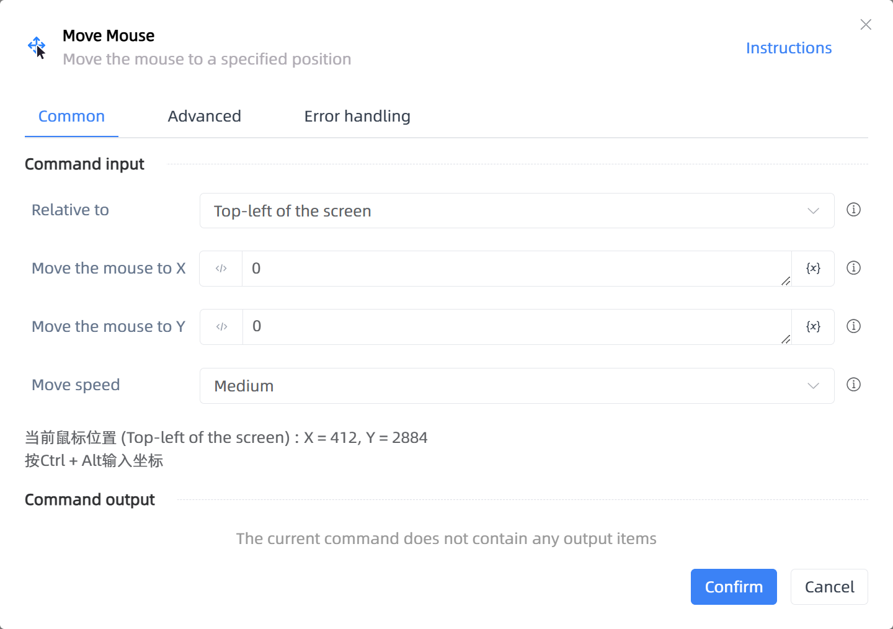

# Move Mouse

## Function Description

:::tip 
Move the mouse to a specified position
:::

## Configuration Item Description

### General

**Command Input**

- **Relative to**`Integer`: The position of the mouse

- **Move the mouse to X**`Integer`: Relative horizontal coordinate

- **Move the mouse to Y**`Integer`: Relative vertical coordinate

- **Move speed**`Integer`: Speed of mouse movement

**Command Output**

No output for the current command

### Advanced

- **Delay Before(milliseconds)**`Integer`: The waiting time before instruction execution

- **Delay after execution (milliseconds)**`Integer`: Time to wait after the instruction is executed

**Command Output**

### Error Handling

- **Print Error Logs**`Boolean`: Whether to print error logs to the "Logs" panel when the command fails. Default is checked. 

- **Handling Method**`Integer`:

    - **Terminate Process**: If the command fails, terminate the process.

    - **Ignore Exception and Continue Execution**: If the command fails, ignore the exception and continue the process.

    - **Retry This Command**: If the command fails, retry the command a specified number of times with a specified interval between retries.

## Usage Example

Process logic description:

## Common Errors and Handling

None

## Frequently Asked Questions

None

