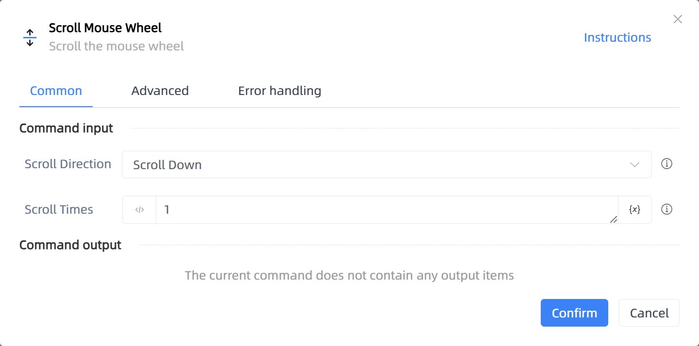

# Scroll Mouse Wheel

## Function Description

:::tip 
Scroll the mouse wheel
:::

## Configuration Item Description

### General

**Command Input**

- **Scroll Direction**`Integer`: Select scroll direction: up or down

- **Scroll Times**`Integer`: Enter the number of scrolls

**Command Output**

No output for the current command

### Advanced

- **Keyboard Auxiliary Buttons**`Integer`: Keyboard function key to press

- **Delay Before(milliseconds)**`Integer`: The waiting time before instruction execution

- **Delay After Execution (ms)**`Integer`: Time to wait after the command is executed

- **Move Mouse to Specified Position Before Scrolling**`Boolean`: Move mouse to specified position before scrolling

- **Relative To**`Integer`: Mouse position

- **Move Mouse to X**`Integer`: Relative horizontal coordinate

- **Move Mouse to Y**`Integer`: Relative vertical coordinate

- **Movement Speed**`Integer`: Speed of the mouse movement

**Command Output**

### Error Handling

- **Print Error Logs**`Boolean`: Whether to print error logs to the "Logs" panel when the command fails. Default is checked. 

- **Handling Method**`Integer`:

    - **Terminate Process**: If the command fails, terminate the process.

    - **Ignore Exception and Continue Execution**: If the command fails, ignore the exception and continue the process.

    - **Retry This Command**: If the command fails, retry the command a specified number of times with a specified interval between retries.

## Usage Example

Process logic description:

## Common Errors and Handling

None

## Frequently Asked Questions

None

