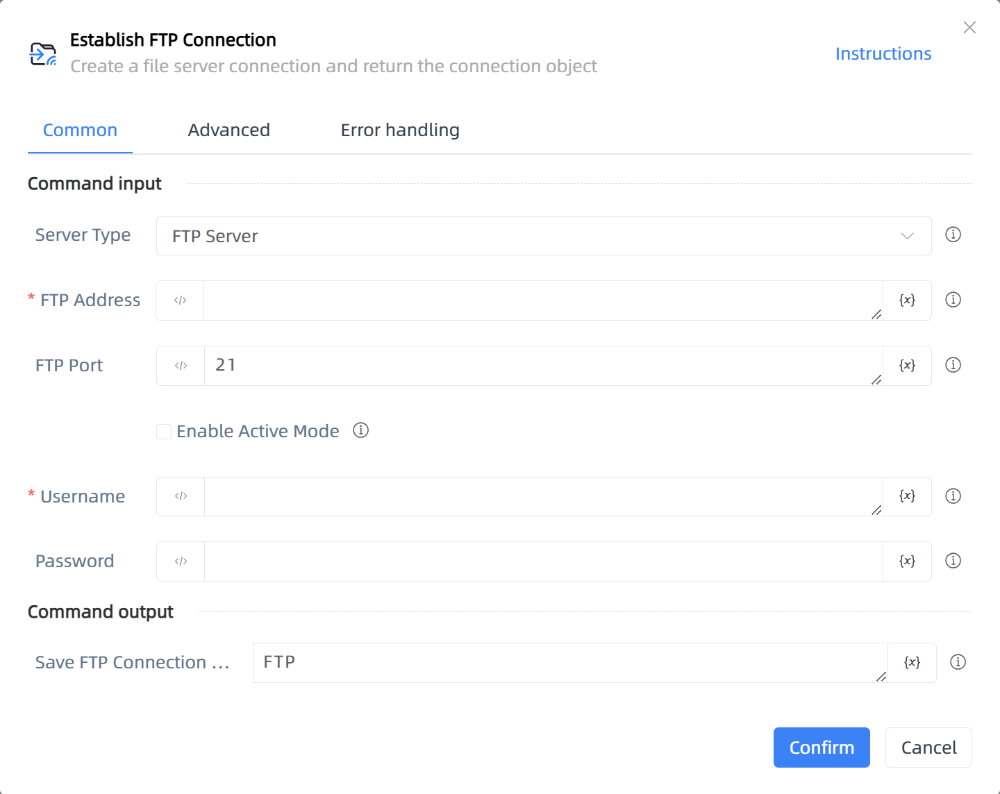

# Establish FTP Connection

## Function Description

:::tip 
Create a file server connection and return the connection object
:::

## Configuration Item Description

### General

**Command Input**

- **Server Type**`Integer`: The server type of the connection object to be created

- **FTP Address**`string`: The FTP server address

- **FTP Port**`Integer`: The FTP server port

- **Enable Active Mode**`Boolean`: Passive mode is usually recommended for FTP. If the FTP server is configured to support only active mode or if the server's network configuration does not allow passive mode data connections, then the client should use active mode.

- **Connection Type**`Integer`: The method for connecting to the remote server. The default is password-based connection.

- **Username**`string`: The username for connecting to the FTP server

- **Password**`string`: The password for connecting to the FTP server

- **Key File**`string`: The key file for connecting to the server

**Command Output**

- **Save FTP Connection Object to**`TFTP`: Specify a variable name to store the FTP connection object

### Advanced

- **Delay Before(milliseconds)**`Integer`: The waiting time before instruction execution

- **Connection Timeout (ms)**`Integer`: Enter the connection timeout in milliseconds

**Command Output**

### Error Handling

- **Print Error Logs**`Boolean`: Whether to print error logs to the "Logs" panel when the command fails. Default is checked. 

- **Handling Method**`Integer`:

    - **Terminate Process**: If the command fails, terminate the process.

    - **Ignore Exception and Continue Execution**: If the command fails, ignore the exception and continue the process.

    - **Retry This Command**: If the command fails, retry the command a specified number of times with a specified interval between retries.

## Usage Example

Process logic description:

## Common Errors and Handling

None

## Frequently Asked Questions

None

