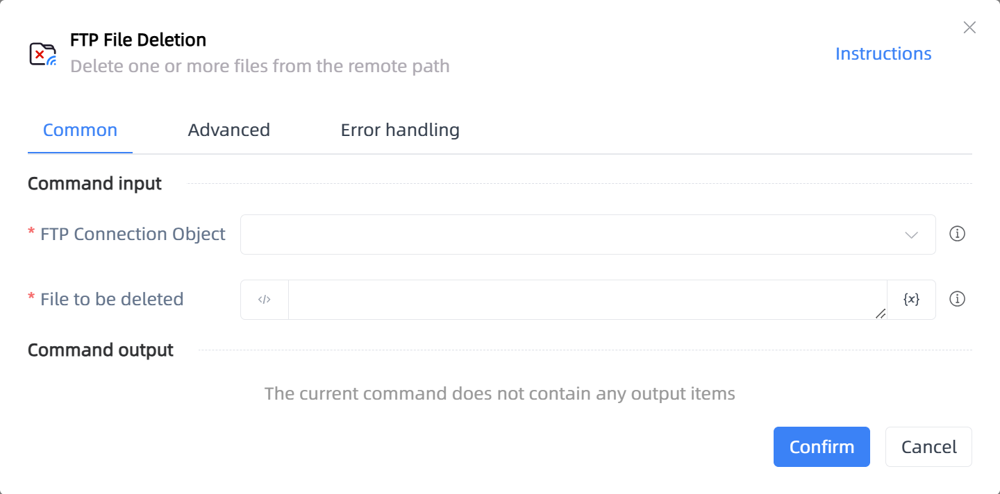

# FTP File Deletion

## Function Description

:::tip 
Delete one or more files from the remote path
:::

## Configuration Item Description

### General

**Command Input**

- **FTP Connection Object**`TFTP`: The FTP object from which the files will be deleted

- **File to be deleted**`string`: The name(s) of the remote file(s) to be deleted, separated by '|' if multiple

**Command Output**

No output for the current command

### Advanced

- **Delay Before(milliseconds)**`Integer`: The waiting time before instruction execution

**Command Output**

### Error Handling

- **Print Error Logs**`Boolean`: Whether to print error logs to the "Logs" panel when the command fails. Default is checked. 

- **Handling Method**`Integer`:

    - **Terminate Process**: If the command fails, terminate the process.

    - **Ignore Exception and Continue Execution**: If the command fails, ignore the exception and continue the process.

    - **Retry This Command**: If the command fails, retry the command a specified number of times with a specified interval between retries.

## Usage Example

Process logic description:

## Common Errors and Handling

None

## Frequently Asked Questions

None

