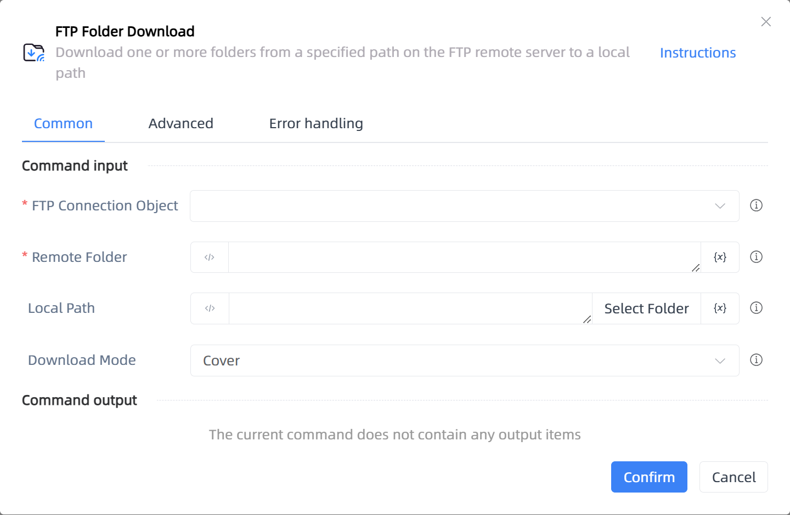

# FTP Folder Download

## Function Description

:::tip 
Download one or more folders from a specified path on the FTP remote server to a local path
:::

## Configuration Item Description

### General

**Command Input**

- **FTP Connection Object**`TFTP`: The FTP object from which the folder needs to be downloaded

- **Remote Folder**`string`: The folder or list of folders to be downloaded, separated by '|' for multiple folders

- **Local Path**`string`: The local path where the remote folder will be downloaded

- **Download Mode**`Integer`: How to handle existing sub-files in the local folder when downloading the remote folder

**Command Output**

No output for the current command

### Advanced

- **Delay Before(milliseconds)**`Integer`: The waiting time before instruction execution

**Command Output**

### Error Handling

- **Print Error Logs**`Boolean`: Whether to print error logs to the "Logs" panel when the command fails. Default is checked. 

- **Handling Method**`Integer`:

    - **Terminate Process**: If the command fails, terminate the process.

    - **Ignore Exception and Continue Execution**: If the command fails, ignore the exception and continue the process.

    - **Retry This Command**: If the command fails, retry the command a specified number of times with a specified interval between retries.

## Usage Example

Process logic description:

## Common Errors and Handling

None

## Frequently Asked Questions

None

