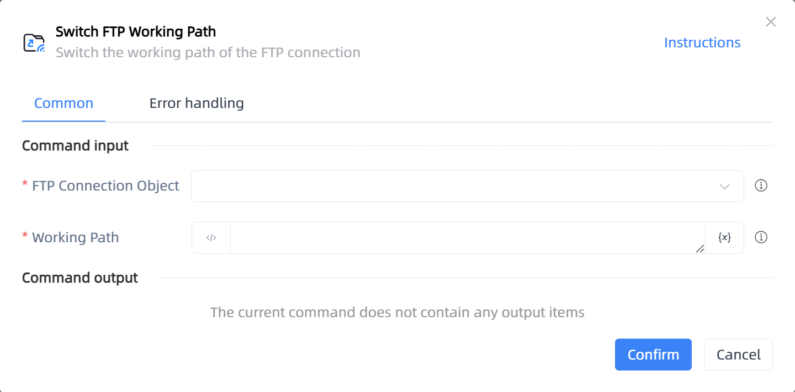

# Switch FTP Working Path

## Function Description

:::tip 
Switch the working path of the FTP connection
:::

## Configuration Item Description

### General

**Command Input**

- **FTP Connection Object**`TFTP`: The FTP object for which the working path needs to be switched

- **Working Path**`string`: The new working path to which it needs to be switched

**Command Output**

No output for the current command

**Command Output**

### Error Handling

- **Print Error Logs**`Boolean`: Whether to print error logs to the "Logs" panel when the command fails. Default is checked. 

- **Handling Method**`Integer`:

    - **Terminate Process**: If the command fails, terminate the process.

    - **Ignore Exception and Continue Execution**: If the command fails, ignore the exception and continue the process.

    - **Retry This Command**: If the command fails, retry the command a specified number of times with a specified interval between retries.

## Usage Example

Process logic description:

## Common Errors and Handling

None

## Frequently Asked Questions

None

