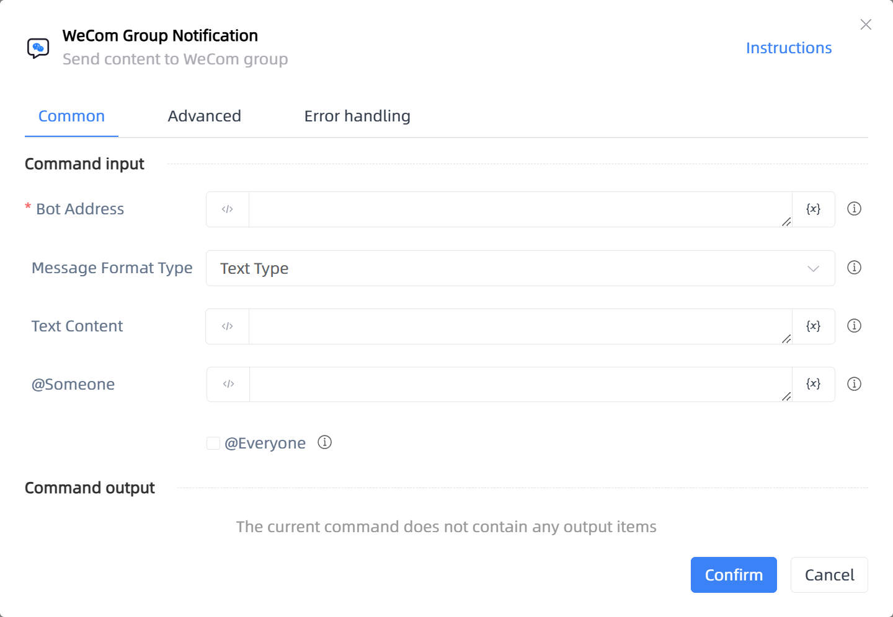

# WeCom Group Notification

## Function Description

:::tip 
Send content to WeCom group
:::

## Configuration Item Description

### General

**Command Input**

- **Bot Address**`string`: The bot's web address, i.e., WebHook, needs to be applied for separately

- **Message Format Type**`Integer`: Message type and data format

- **Text Content**`string`: Text content, up to 2048 bytes

- **MarkDown Content**`string`: MarkDown content, up to 4096 bytes

- **File Path**`string`: The file size should be between 5B and 20MB

- **Image Path**`string`: Should not exceed 2MB, supports JPG and PNG formats

- **@Someone**`String`: Enter the phone number bound to the member you want to @, for multiple members, switch to programming mode and input a list of numbers, like ['PhoneNumber1', 'PhoneNumber2']

- **@Everyone**`Boolean`: @Everyone

**Command Output**

No output for the current command

### Advanced

- **Delay Before(milliseconds)**`Integer`: The waiting time before instruction execution

**Command Output**

### Error Handling

- **Print Error Logs**`Boolean`: Whether to print error logs to the "Logs" panel when the command fails. Default is checked. 

- **Handling Method**`Integer`:

    - **Terminate Process**: If the command fails, terminate the process.

    - **Ignore Exception and Continue Execution**: If the command fails, ignore the exception and continue the process.

    - **Retry This Command**: If the command fails, retry the command a specified number of times with a specified interval between retries.

## Usage Example

Process logic description:

## Common Errors and Handling

None

## Frequently Asked Questions

None

