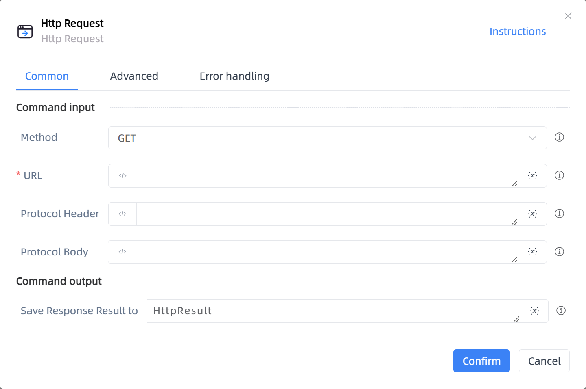

# Http Request

## Function Description

:::tip 
Http Request
:::

## Configuration Item Description

### General

**Command Input**

- **Method**`Integer`: Select the operation method

- **URL**`string`: Please enter the request URL

- **Protocol Header**`string`: Protocol headers, multiple lines, use commas to separate, each line in the format 'Header Name: Header Content'

- **Protocol Body**`string`: Enter the content to be sent to the server

**Command Output**

- **Save Response Result to**`TList<String>`: Specify a variable name that will store the response result

### Advanced

- **Delay Before(milliseconds)**`Integer`: The waiting time before instruction execution

- **Connection Timeout in Milliseconds**`Integer`: Enter the connection timeout in seconds

- **Save Result to File**`Boolean`: Whether to save the response result to a file

- **File Save Directory**`string`: Enter the path where the file will be saved

- **File Name**`string`: Enter the name to be saved in the folder

**Command Output**

### Error Handling

- **Print Error Logs**`Boolean`: Whether to print error logs to the "Logs" panel when the command fails. Default is checked. 

- **Handling Method**`Integer`:

    - **Terminate Process**: If the command fails, terminate the process.

    - **Ignore Exception and Continue Execution**: If the command fails, ignore the exception and continue the process.

    - **Retry This Command**: If the command fails, retry the command a specified number of times with a specified interval between retries.

## Usage Example

Process logic description:

## Common Errors and Handling

None

## Frequently Asked Questions

None

