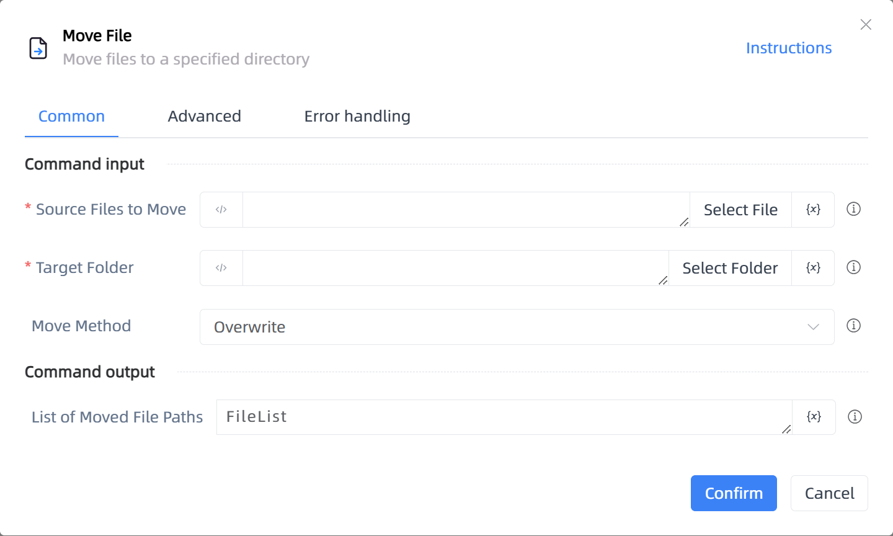

# Move File

## Function Description

:::tip 
Move files to a specified directory
:::

## Configuration Item Description

### General

**Command Input**

- **Source Files to Move**`string`: Enter or select the file paths to move. Separate multiple file paths with '|'.

- **Target Folder**`string`: Enter the target folder path

- **Move Method**`Integer`: How to handle when the file already exists

**Command Output**

- **List of Moved File Paths**`TList<String>`: Enter a name to save the list of moved file paths

### Advanced

- **Delay Before(milliseconds)**`Integer`: The waiting time before instruction execution

**Command Output**

### Error Handling

- **Print Error Logs**`Boolean`: Whether to print error logs to the "Logs" panel when the command fails. Default is checked. 

- **Handling Method**`Integer`:

    - **Terminate Process**: If the command fails, terminate the process.

    - **Ignore Exception and Continue Execution**: If the command fails, ignore the exception and continue the process.

    - **Retry This Command**: If the command fails, retry the command a specified number of times with a specified interval between retries.

## Usage Example

Process logic description:

## Common Errors and Handling

None

## Frequently Asked Questions

None

