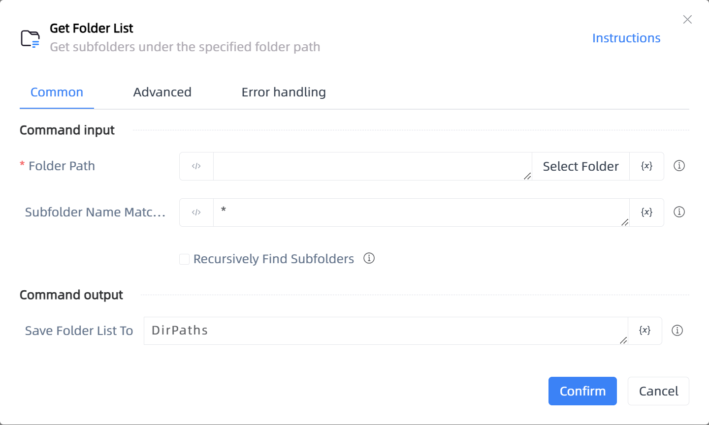

# Get Folder List

## Function Description

:::tip 
Get subfolders under the specified folder path
:::

## Configuration Item Description

### General

**Command Input**

- **Folder Path**`string`: The path of the folder to search

- **Subfolder Name Match Rule**`string`: Enter the folder name match rule, wildcards are allowed. For example: 'Images*', 'Images?', multiple rules can be separated by commas, e.g., rule1, rule2

- **Recursively Find Subfolders**`Boolean`: Whether to recursively find subfolders

**Command Output**

- **Save Folder List To**`TList<String>`: Enter a name to save the folder list

### Advanced

- **Delay Before(milliseconds)**`Integer`: The waiting time before instruction execution

**Command Output**

### Error Handling

- **Print Error Logs**`Boolean`: Whether to print error logs to the "Logs" panel when the command fails. Default is checked. 

- **Handling Method**`Integer`:

    - **Terminate Process**: If the command fails, terminate the process.

    - **Ignore Exception and Continue Execution**: If the command fails, ignore the exception and continue the process.

    - **Retry This Command**: If the command fails, retry the command a specified number of times with a specified interval between retries.

## Usage Example

Process logic description:

## Common Errors and Handling

None

## Frequently Asked Questions

None

