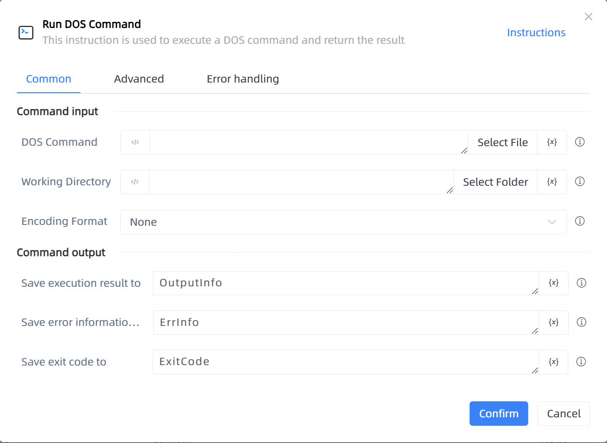

# Run DOS Command

## Function Description

:::tip 
This instruction is used to execute a DOS command and return the result
:::

## Configuration Item Description

### General

**Command Input**

- **DOS Command**`string`: Input the DOS command string

- **Working Directory**`string`: The working directory for the command in the process

- **Encoding Format**`Integer`: Set the text format for the command line

**Command Output**

- **Save execution result to**`string`: Output a name to save the result of the DOS command execution

- **Save error information to**`string`: Input a name to save the error information

- **Save exit code to**`Integer`: Input a name to save the exit code, which should be an integer

### Advanced

- **Delay Before(milliseconds)**`Integer`: The waiting time before instruction execution

**Command Output**

### Error Handling

- **Print Error Logs**`Boolean`: Whether to print error logs to the "Logs" panel when the command fails. Default is checked. 

- **Handling Method**`Integer`:

    - **Terminate Process**: If the command fails, terminate the process.

    - **Ignore Exception and Continue Execution**: If the command fails, ignore the exception and continue the process.

    - **Retry This Command**: If the command fails, retry the command a specified number of times with a specified interval between retries.

## Usage Example

Process logic description:

## Common Errors and Handling

None

## Frequently Asked Questions

None

