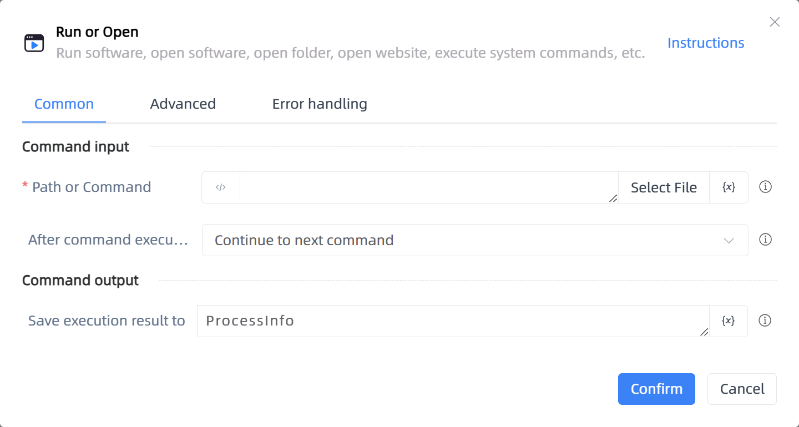

# Run or Open

## Function Description

:::tip 
Run software, open software, open folder, open website, execute system commands, etc.
:::

## Configuration Item Description

### General

**Command Input**

- **Path or Command**`string`: Open a program or file

- **After command execution**`Integer`: Choose whether to continue executing commands or wait for program to finish, file to close

- **Wait timeout**`Boolean`: If unchecked, it means wait indefinitely

- **Wait time**`Integer`: Maximum wait time

**Command Output**

- **Save execution result to**`TRPADictionary`: Enter a name to save the execution result

### Advanced

- **Arguments (optional)**`string`: Additional arguments for program execution

- **Working Directory (optional)**`string`: The working directory for the command in the process

- **Window Style**`Integer`: Specify how the new window should be displayed

- **Delay Before(milliseconds)**`Integer`: The waiting time before instruction execution

**Command Output**

### Error Handling

- **Print Error Logs**`Boolean`: Whether to print error logs to the "Logs" panel when the command fails. Default is checked. 

- **Handling Method**`Integer`:

    - **Terminate Process**: If the command fails, terminate the process.

    - **Ignore Exception and Continue Execution**: If the command fails, ignore the exception and continue the process.

    - **Retry This Command**: If the command fails, retry the command a specified number of times with a specified interval between retries.

## Usage Example

Process logic description:

## Common Errors and Handling

None

## Frequently Asked Questions

None

