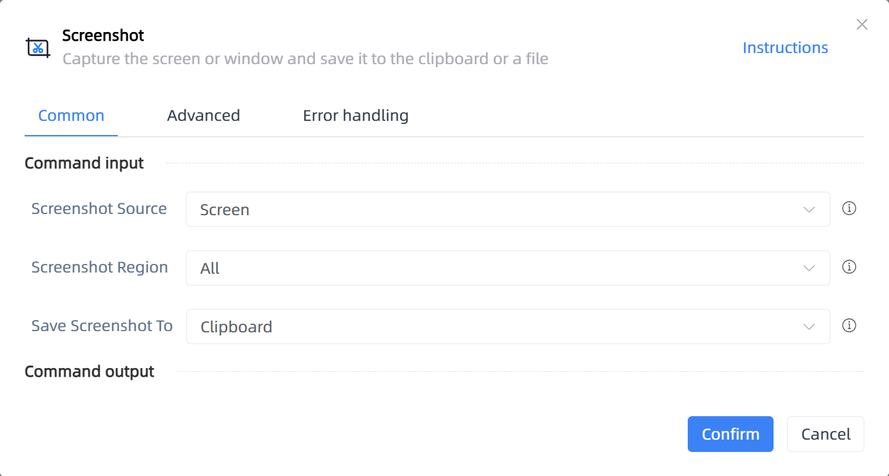

# Screenshot

## Function Description

:::tip 
Capture the screen or window and save it to the clipboard or a file
:::

## Configuration Item Description

### General

**Command Input**

- **Screenshot Source**`Integer`: Choose whether to capture the entire screen or a specific window

- **Window Object**`TWinObj`: Specify a window object to capture

- **Screenshot Region**`Integer`: The region to capture

- **X1**`Integer`: X1 coordinate of the screenshot area

- **Y1**`Integer`: Y1 coordinate of the screenshot area

- **X2**`Integer`: X2 coordinate of the screenshot area

- **Y2**`Integer`: Y2 coordinate of the screenshot area

- **Save Screenshot To**`Integer`: Choose where to save the screenshot

- **Image Save Location**`string`: Location where the image is saved on the computer

**Command Output**

- **Did the user cancel the screenshot**`string`: Input a variable to store whether the user canceled the screenshot

### Advanced

- **Delay Before(milliseconds)**`Integer`: The waiting time before instruction execution

### Error Handling

- **Print Error Logs**`Boolean`: Whether to print error logs to the "Logs" panel when the command fails. Default is checked. 

- **Handling Method**`Integer`:

    - **Terminate Process**: If the command fails, terminate the process.

    - **Ignore Exception and Continue Execution**: If the command fails, ignore the exception and continue the process.

    - **Retry This Command**: If the command fails, retry the command a specified number of times with a specified interval between retries.

## Usage Example

Process logic description:

## Common Errors and Handling

None

## Frequently Asked Questions

None

