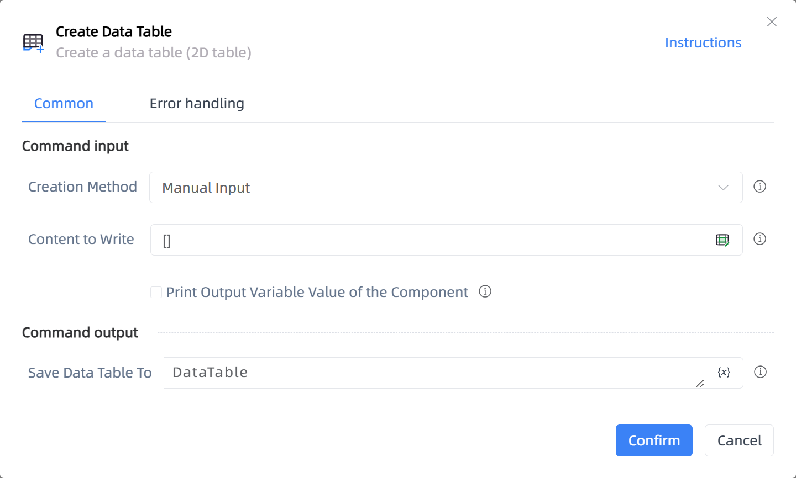

# Create Data Table

## Function Description

:::tip 
Create a data table (2D table)
:::

## Configuration Item Description

### General

**Command Input**

- **Creation Method**`Integer`: Method of creating the data table

- **Content to Write**`string`: Supports two-dimensional list data and dictionaries, example: [["a","b","c"],[1,2,3]], {"Name":["Tom","Jack","Steve","Ricky"],"Age":[28,34,29,42]}

- **File Path**`string`: Enter or select the file path

- **Sheet Name**`string`: If left blank, it defaults to the currently activated sheet.

- **Print Output Variable Value of the Component**`Boolean`: After checking, the variable data or variable values generated by the component will be output and printed to the console log output

**Command Output**

- **Save Data Table To**`TDataTable`: Specify a variable to save the data table

### Advanced

- **Encoding Format**`Integer`: If the data appears with garbled characters, set the encoding format. Generally use utf-8 for Excel files and gb18030 for CSV files.

**Command Output**

### Error Handling

- **Print Error Logs**`Boolean`: Whether to print error logs to the "Logs" panel when the command fails. Default is checked. 

- **Handling Method**`Integer`:

    - **Terminate Process**: If the command fails, terminate the process.

    - **Ignore Exception and Continue Execution**: If the command fails, ignore the exception and continue the process.

    - **Retry This Command**: If the command fails, retry the command a specified number of times with a specified interval between retries.

## Usage Example

Process logic description:

## Common Errors and Handling

None

## Frequently Asked Questions

None

