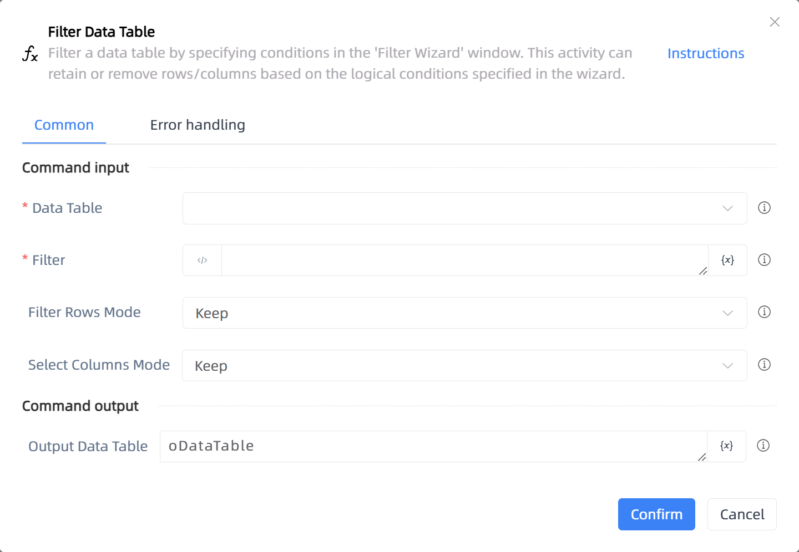

# Filter Data Table

## Function Description

:::tip 
Filter a data table by specifying conditions in the 'Filter Wizard' window. This activity can retain or remove rows/columns based on the logical conditions specified in the wizard.
:::

## Configuration Item Description

### General

**Command Input**

- **Data Table**`TDataTable`: The data table to be filtered.

- **Filter**`String`: Filter.

- **Filter Rows Mode**`Integer`: Filter Rows Mode

- **Select Columns Mode**`Integer`: Select Columns Mode

**Command Output**

- **Output Data Table**`TDataTable`: The variable of the generated filtered data table.

**Command Output**

### Error Handling

- **Print Error Logs**`Boolean`: Whether to print error logs to the "Logs" panel when the command fails. Default is checked. 

- **Handling Method**`Integer`:

    - **Terminate Process**: If the command fails, terminate the process.

    - **Ignore Exception and Continue Execution**: If the command fails, ignore the exception and continue the process.

    - **Retry This Command**: If the command fails, retry the command a specified number of times with a specified interval between retries.

## Usage Example

Process logic description:

## Common Errors and Handling

None

## Frequently Asked Questions

None

