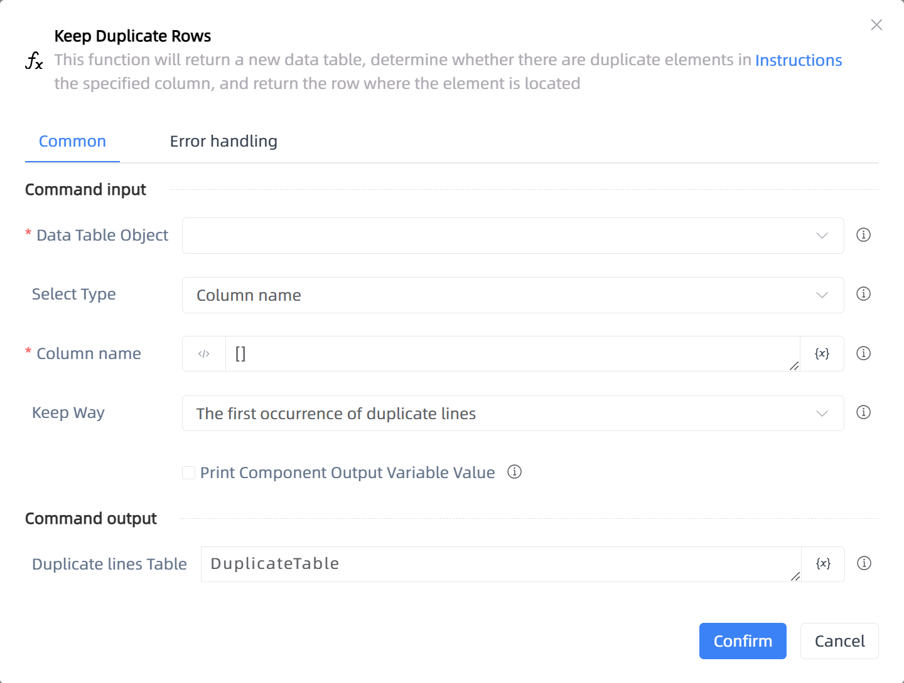

# Keep Duplicate Rows

## Function Description

:::tip 
This function will return a new data table, determine whether there are duplicate elements in the specified column, and return the row where the element is located
:::

## Configuration Item Description

### General

**Command Input**

- **Data Table Object**`TDataTable`: You can use the variable returned by the 'Create Data Table' component.

- **Select Type**`Integer`: Select column name or column number

- **Column name**`string`: When the selected column data is consistent, it is retained. Single column input [column name], multi column input [column name 1, column name 2, column name 3]

- **Column number**`string`: When the selected column data is consistent, it is retained. Single column input [1], multi column input [1,2,3]

- **Keep Way**`Integer`: Select retention method

- **Print Component Output Variable Value**`Boolean`: When checked, the variable data or value generated by the component will be output and printed to the console output log.

**Command Output**

- **Duplicate lines Table**`TDataTable`: Data table returned after retention

**Command Output**

### Error Handling

- **Print Error Logs**`Boolean`: Whether to print error logs to the "Logs" panel when the command fails. Default is checked. 

- **Handling Method**`Integer`:

    - **Terminate Process**: If the command fails, terminate the process.

    - **Ignore Exception and Continue Execution**: If the command fails, ignore the exception and continue the process.

    - **Retry This Command**: If the command fails, retry the command a specified number of times with a specified interval between retries.

## Usage Example

Process logic description:

## Common Errors and Handling

None

## Frequently Asked Questions

None

