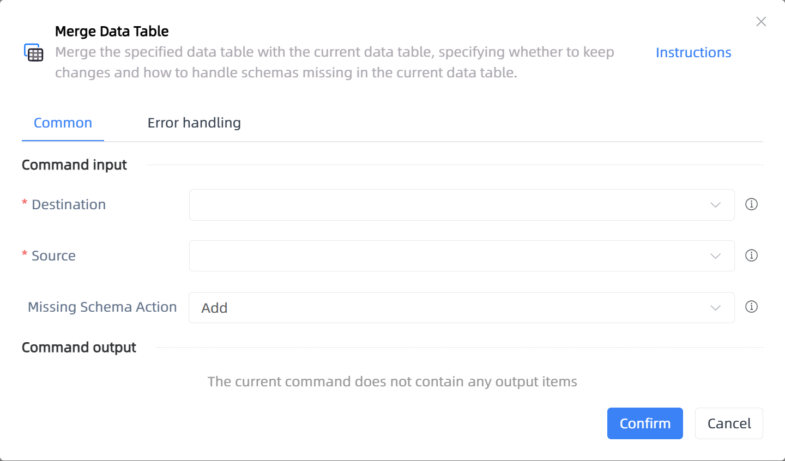

# Merge Data Table

## Function Description

:::tip 
Merge the specified data table with the current data table, specifying whether to keep changes and how to handle schemas missing in the current data table.
:::

## Configuration Item Description

### General

**Command Input**

- **Destination**`TDataTable`: The data table object to which the source data table will be merged.

- **Source**`TDataTable`: The data table object to be added to the destination data table.

- **Missing Schema Action**`Integer`: Missing Schema Action

**Command Output**

No output for the current command

**Command Output**

### Error Handling

- **Print Error Logs**`Boolean`: Whether to print error logs to the "Logs" panel when the command fails. Default is checked. 

- **Handling Method**`Integer`:

    - **Terminate Process**: If the command fails, terminate the process.

    - **Ignore Exception and Continue Execution**: If the command fails, ignore the exception and continue the process.

    - **Retry This Command**: If the command fails, retry the command a specified number of times with a specified interval between retries.

## Usage Example

Process logic description:

## Common Errors and Handling

None

## Frequently Asked Questions

None

