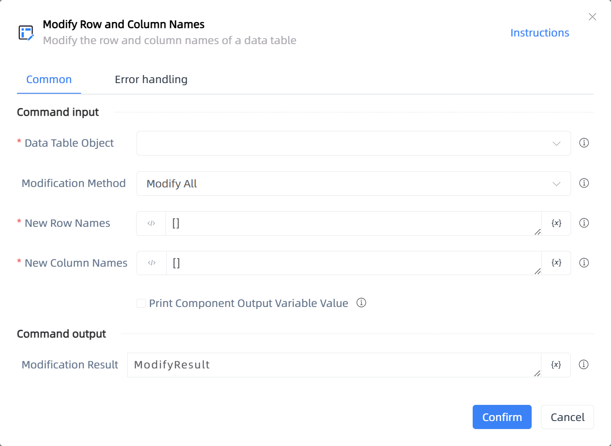

# Modify Row and Column Names

## Function Description

:::tip 
Modify the row and column names of a data table
:::

## Configuration Item Description

### General

**Command Input**

- **Data Table Object**`TDataTable`: The variable returned by the 'Create Data Table' component can be used here.

- **Modification Method**`Integer`: Supports modifying all header names of the data table at once or only part of them.

- **New Row Names**`string`: Enter a list with the same length as the original row names. When [], the original row name will not be modified. For example, [Row Name 1, Row Name 2]. The default row name is the first element of each row in the data table.

- **New Column Names**`string`: Enter a list with the same length as the original column names. When [], the original column name will not be modified. For example, [Column Name 1, Column Name 2].

- **Modify Row Names**`string`: Enter the original row name and new row name. For example, {"Original Row Name 1":"New Row Name 1","Original Row Name 2":"New Row Name 2"}

- **Modify Column Names**`string`: Enter the original and new column names. For example, {"Original Column Name 1":"New Column Name 1","Original Column Name 2":"New Column Name 2"}

- **Print Component Output Variable Value**`Boolean`: Check to output the variable data or value generated by the component during runtime, and print it to the console log.

**Command Output**

- **Modification Result**`TDataTable`: The data table after modifying row and column names

**Command Output**

### Error Handling

- **Print Error Logs**`Boolean`: Whether to print error logs to the "Logs" panel when the command fails. Default is checked. 

- **Handling Method**`Integer`:

    - **Terminate Process**: If the command fails, terminate the process.

    - **Ignore Exception and Continue Execution**: If the command fails, ignore the exception and continue the process.

    - **Retry This Command**: If the command fails, retry the command a specified number of times with a specified interval between retries.

## Usage Example

Process logic description:

## Common Errors and Handling

None

## Frequently Asked Questions

None

