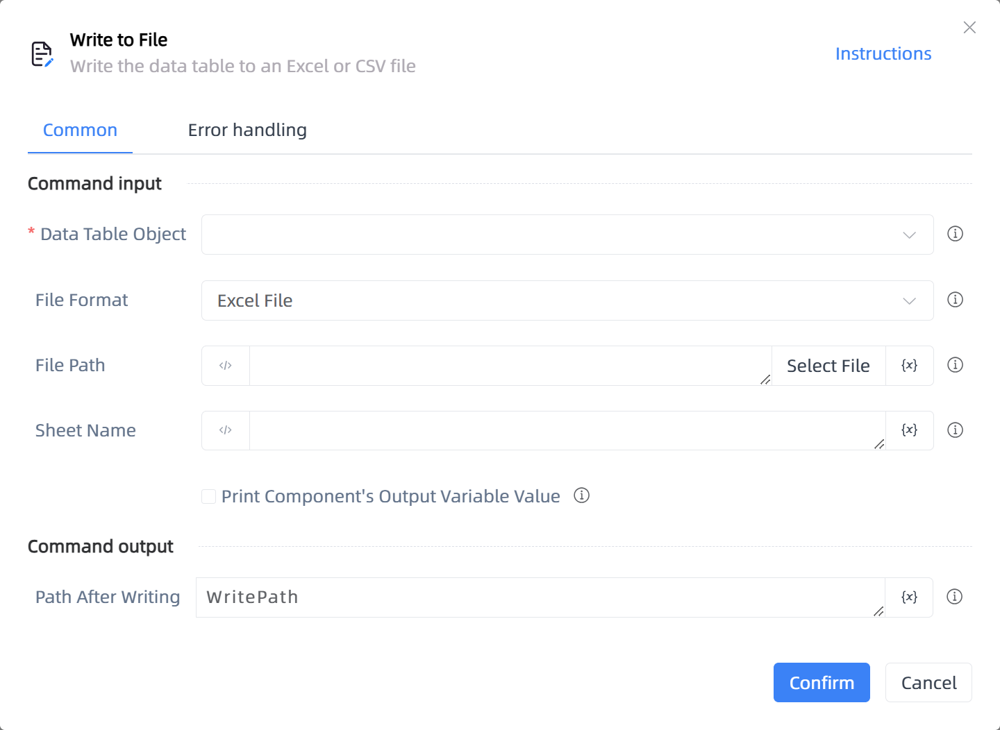

# Write to File

## Function Description

:::tip 
Write the data table to an Excel or CSV file
:::

## Configuration Item Description

### General

**Command Input**

- **Data Table Object**`TDataTable`: You can use the variable returned by the 'Create Data Table' component.

- **File Format**`Integer`: Supports exporting the data table to an Excel or CSV file.

- **File Path**`string`: Enter or select the file path

- **Sheet Name**`string`: If left blank, it defaults to the currently activated sheet.

- **Print Component's Output Variable Value**`Boolean`: After checking, the variable data or variable value generated by the component will be output and printed to the console log output.

**Command Output**

- **Path After Writing**`string`: Output the path after successful writing.

**Command Output**

### Error Handling

- **Print Error Logs**`Boolean`: Whether to print error logs to the "Logs" panel when the command fails. Default is checked. 

- **Handling Method**`Integer`:

    - **Terminate Process**: If the command fails, terminate the process.

    - **Ignore Exception and Continue Execution**: If the command fails, ignore the exception and continue the process.

    - **Retry This Command**: If the command fails, retry the command a specified number of times with a specified interval between retries.

## Usage Example

Process logic description:

## Common Errors and Handling

None

## Frequently Asked Questions

None

