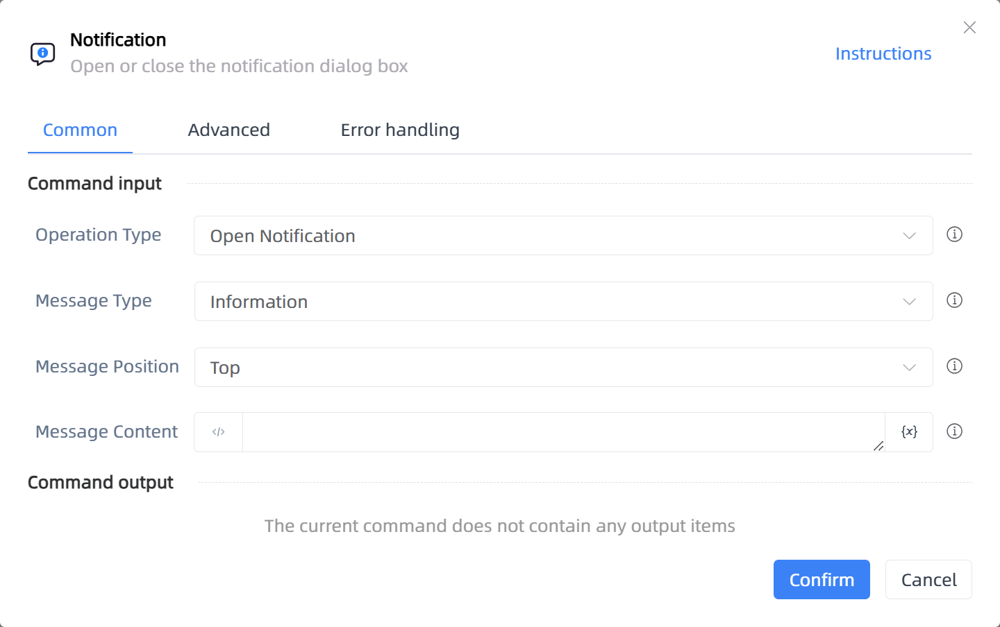

# Notification

## Function Description

:::tip 
Open or close the notification dialog box
:::

## Configuration Item Description

### General

**Command Input**

- **Operation Type**`Integer`: Choose to open or close the notification

- **Message Type**`Integer`: The type of message displayed in the notification, including: Information, Warning, Error

- **Message Position**`Integer`: The position of the notification on the screen, such as: Top, Bottom, Bottom-Right

- **Message Content**`string`: The information to be displayed to the user in the notification dialog box

**Command Output**

No output for the current command

### Advanced

- **Close Timeout (milliseconds)**`Integer`: The duration for which the notification is displayed, default is 3000 milliseconds

**Command Output**

### Error Handling

- **Print Error Logs**`Boolean`: Whether to print error logs to the "Logs" panel when the command fails. Default is checked. 

- **Handling Method**`Integer`:

    - **Terminate Process**: If the command fails, terminate the process.

    - **Ignore Exception and Continue Execution**: If the command fails, ignore the exception and continue the process.

    - **Retry This Command**: If the command fails, retry the command a specified number of times with a specified interval between retries.

## Usage Example

Process logic description:

## Common Errors and Handling

None

## Frequently Asked Questions

None

