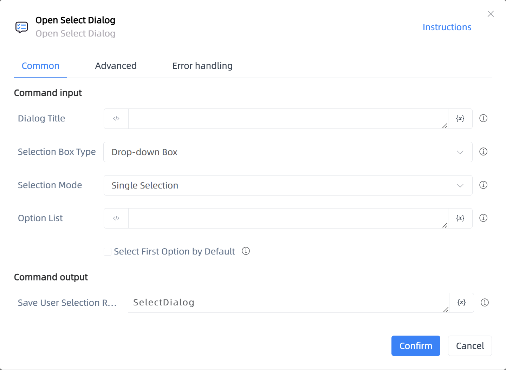

# Open Select Dialog

## Function Description

:::tip 
Open Select Dialog
:::

## Configuration Item Description

### General

**Command Input**

- **Dialog Title**`string`: Dialog Title

- **Selection Box Type**`Integer`: Selection Box Type

- **Selection Mode**`Integer`: Selection Mode

- **Option List**`string`: Option list, each line represents an option

- **Select First Option by Default**`Boolean`: Select the first option by default

**Command Output**

- **Save User Selection Result To**`TRPADictionary`: Specify a variable name to save the user selection result, return None if the user cancels the dialog, otherwise return a dict object

### Advanced

- **Dialog Explanation**`string`: Dialog Explanation

- **Timeout (milliseconds)**`Integer`: The duration for which the notification is displayed, default is 30000 milliseconds

**Command Output**

### Error Handling

- **Print Error Logs**`Boolean`: Whether to print error logs to the "Logs" panel when the command fails. Default is checked. 

- **Handling Method**`Integer`:

    - **Terminate Process**: If the command fails, terminate the process.

    - **Ignore Exception and Continue Execution**: If the command fails, ignore the exception and continue the process.

    - **Retry This Command**: If the command fails, retry the command a specified number of times with a specified interval between retries.

## Usage Example

Process logic description:

## Common Errors and Handling

None

## Frequently Asked Questions

None

