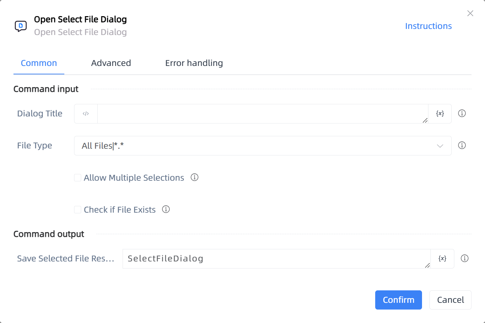

# Open Select File Dialog

## Function Description

:::tip 
Open Select File Dialog
:::

## Configuration Item Description

### General

**Command Input**

- **Dialog Title**`string`: Dialog Title

- **File Type**`Integer`: File Type

- **Allow Multiple Selections**`Boolean`: Allow multiple selections

- **Check if File Exists**`Boolean`: Check if file exists

**Command Output**

- **Save Selected File Result To**`string`: Specify a variable name to save the selected file result, return null string if the user cancels the dialog

### Advanced

- **Default Folder**`string`: Default folder

**Command Output**

### Error Handling

- **Print Error Logs**`Boolean`: Whether to print error logs to the "Logs" panel when the command fails. Default is checked. 

- **Handling Method**`Integer`:

    - **Terminate Process**: If the command fails, terminate the process.

    - **Ignore Exception and Continue Execution**: If the command fails, ignore the exception and continue the process.

    - **Retry This Command**: If the command fails, retry the command a specified number of times with a specified interval between retries.

## Usage Example

Process logic description:

## Common Errors and Handling

None

## Frequently Asked Questions

None

