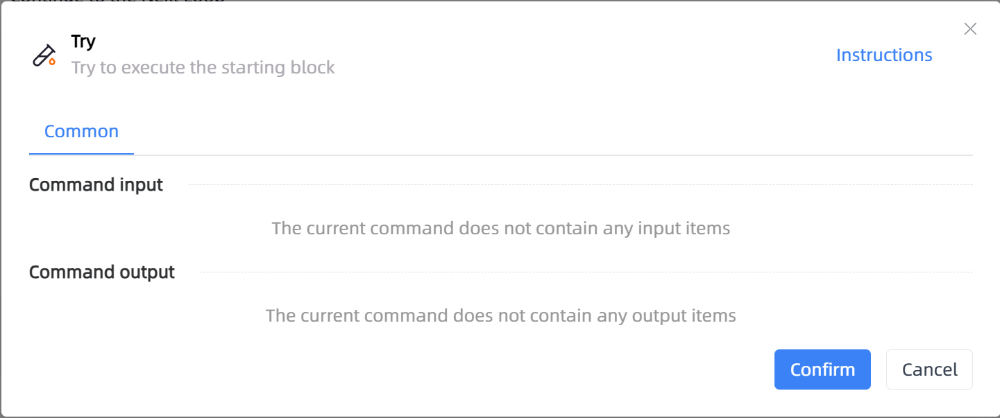

# Try

## Function Description

:::tip 
Try to execute the starting block
:::

## Configuration Item Description

### General

**Command Input**

No input for the current command

**Command Output**

No output for the current command

## Usage Example

Process logic description:

## Common Errors and Handling

None

## Frequently Asked Questions

None

